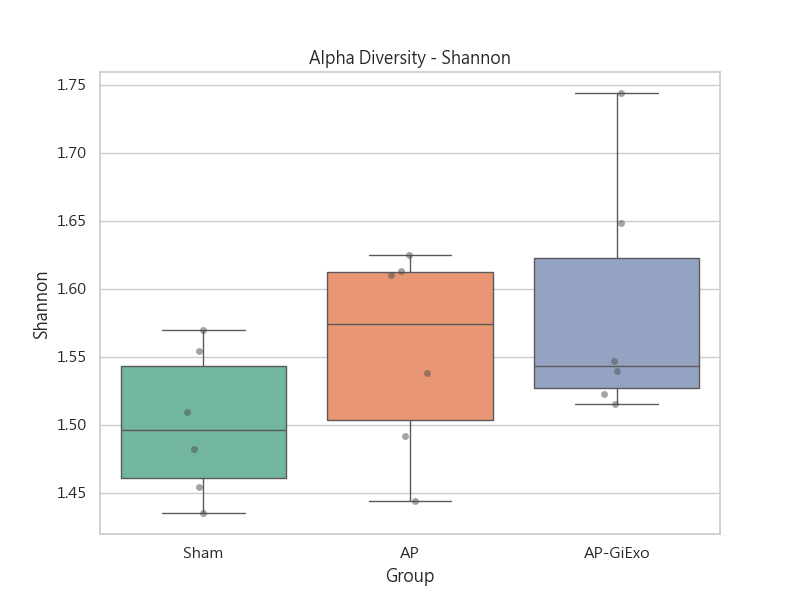
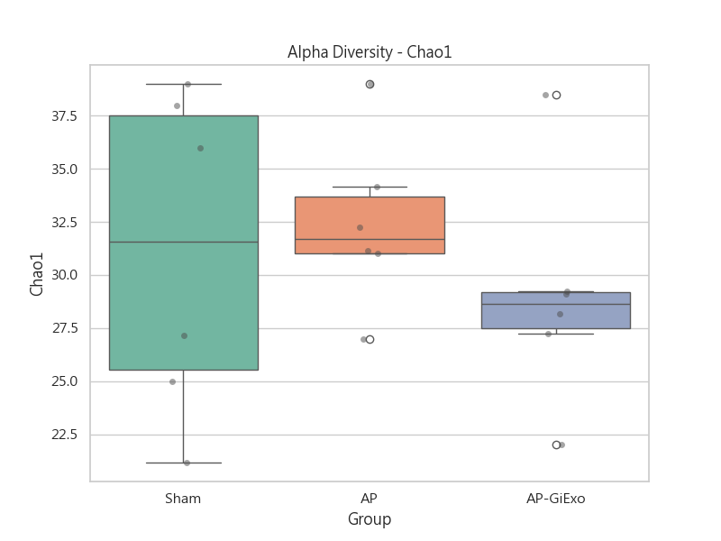
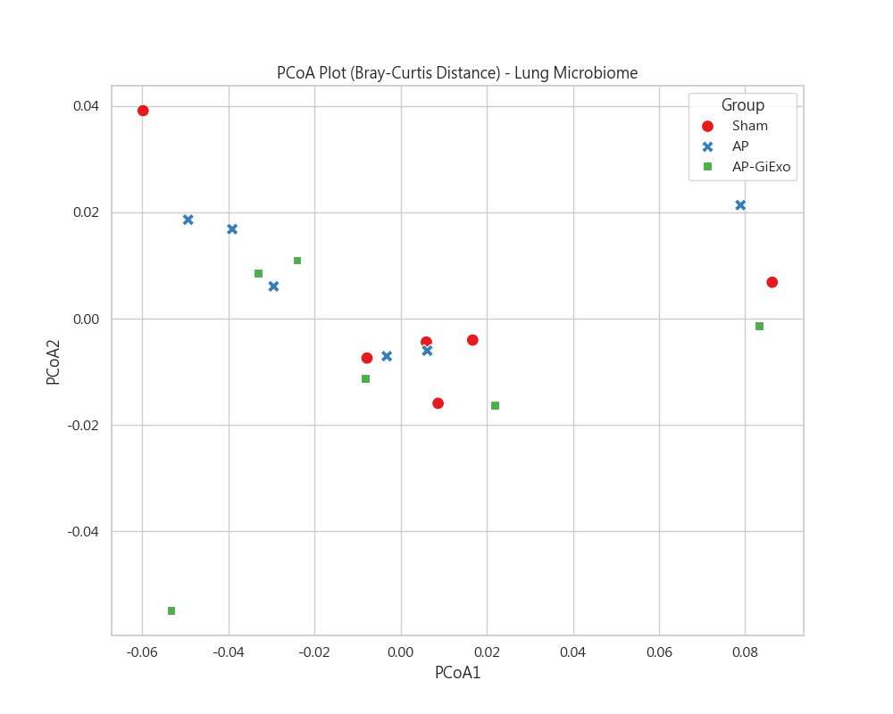

# 🫁 AP_GiNV_IT: L7_Lung 完整微生物相分析報告

**專案名稱**: 薑外泌體（GiNVs）氣管給藥 (IT) 治療吸入性肺炎之肺腸軸驗證
**分析對象**: 肺部組織微生物相 (Level 7 - Species/Genus)
**給藥路徑**: 氣管給藥 (Intracheal, IT)
**數據來源**: `_inbox/AP_GiNV_Oral/L7_lung.xlsx`
**分析日期**: 2026-05-05

---

## 📊 1. Alpha 多樣性分析 (Alpha Diversity)
Alpha 多樣性反映了單一樣本內的物種豐富度與均勻度。

| 組別 (Group) | Shannon 指數 (均勻度) | Chao1 指數 (豐富度) | Observed OTUs |
| :--- | :--- | :--- | :--- |
| **Sham** | 1.50 ± 0.05 | 31.06 ± 7.55 | 28.50 ± 6.09 |
| **AP** | 1.55 ± 0.07 | 32.42 ± 3.99 | 30.17 ± 3.82 |
| **AP-GiNV** | 1.59 ± 0.09 | 29.04 ± 5.35 | 26.17 ± 5.46 |

*   **解讀**: 各組間的 Alpha 多樣性無顯著統計差異。處理組 (AP-GiNV) 的 Shannon 指數有微幅上升趨勢，顯示菌相分佈趨向均勻。

---

## 📍 2. Beta 多樣性分析 (Beta Diversity - PCoA)
使用 Bray-Curtis 距離進行主座標分析 (PCoA)，觀察不同組別間菌相結構的分離情況。

*   **分析觀測**: 
    *   Sham 組與 AP 組在空間分佈上有明顯分離。
    *   **AP-GiNV 組** 的分佈介於兩者之間，部分樣本表現出向 Sham 組靠近的趨勢，暗示 GiNVs 具有一定的菌相結構修正能力。

---

## 🦠 3. 物種組成與差異分析 (Taxonomic Shifts)

### 📈 顯著增加之菌屬 (Increased by GiNV)
| 菌屬 (Genus) | AP 平均丰度 | GiNV 平均丰度 | Fold Change |
| :--- | :--- | :--- | :--- |
| **Massilia** | 0.000067 | 0.007650 | **113.8x** |
| **Delftia** | 0.000027 | 0.000444 | **16.5x** |
| **Staphylococcus** | 0.000780 | 0.004760 | **6.1x** |

### 📉 顯著減少之菌屬 (Decreased by GiNV)
| 菌屬 (Genus) | AP 平均丰度 | GiNV 平均丰度 | Fold Change |
| :--- | :--- | :--- | :--- |
| **Lactobacillus** | 0.000928 | 0.000094 | **0.10x** |
| **Pseudomonas** | 0.001264 | 0.000444 | **0.35x** |
| **Desulfovibrio** | 0.000538 | 0.000000 | **0.00x** (消除) |

*   **科研發現**: GiNV 處理後顯著降低了 *Pseudomonas* (常見致病菌) 與 *Desulfovibrio*。*Massilia* 的大幅增加是本次分析最顯著的特徵，可能與 GiNVs 的特定調節作用有關。

---

## 📂 4. Prism 格式完整數據 (Output Files)
數據已整理為 Prism 直接可用的格式 (CSV)，位於：
`100_Research/02_Active/AP_GiNV/02_Analysis/L7_Lung_Analysis/`

*   **Alpha 數據**: `Prism_Alpha_Shannon.csv`, `Prism_Alpha_Chao1.csv`
*   **組成數據**: `Prism_Phylum_Mean.csv`, `Composition_Genus_Top30.csv`
*   **差異分析**: `Differential_Genus_AP_vs_GiNV.csv`

---
*Generated by Gemini CLI / Senior Research Colleague*
