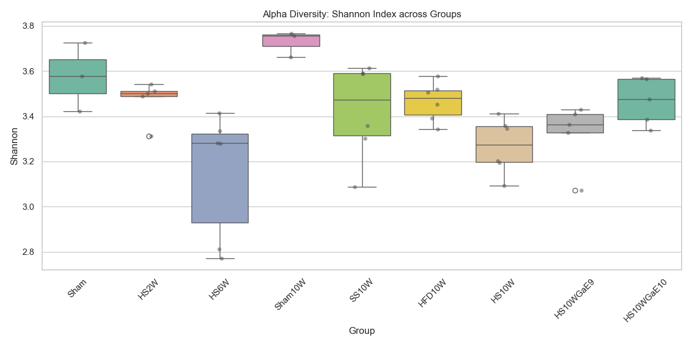
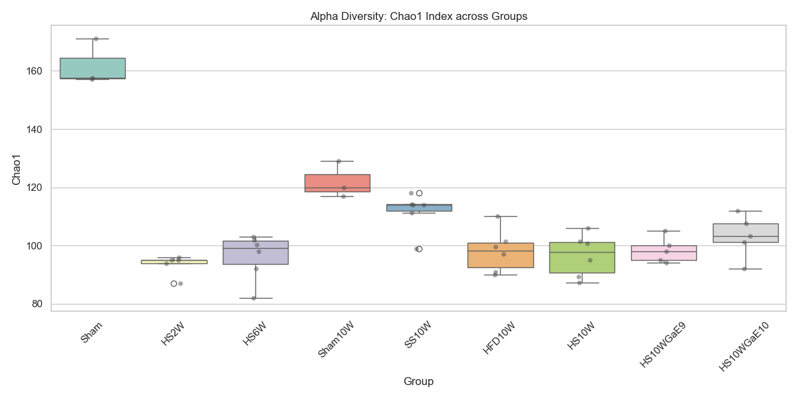

# [20260502] Microbiome_Alpha_Diversity_分析報告 (Path 1-7 整合)

> [!INFO]
> **數據來源**: `Microbiome_Alpha_Diversity.csv`
> **整合範圍**: Path 1~7 所有實驗組別
> **核心指標**: Shannon (均勻度/多樣性), Chao1 (物種豐富度)

---

## 🔬 數據摘要與統計 (Mean ± SD)

| Group | Shannon (Mean ± SD) | Chao1 (Mean ± SD) | Context (Path) |
| :--- | :--- | :--- | :--- |
| **Sham** | 3.58 ± 0.15 | 161.98 ± 7.89 | Path 1 (12W Baseline) |
| **HS2W** | 3.47 ± 0.09 | 93.40 ± 3.65 | Path 2 (Acute Induction) |
| **HS6W** | 3.15 ± 0.28 | 96.23 ± 7.97 | Path 4 (Progression) |
| **Sham10W** | 3.73 ± 0.06 | 122.00 ± 6.24 | Path 1 (20W Baseline) |
| **SS10W** | 3.42 ± 0.21 | 111.78 ± 6.64 | Path 5 (STZ Only) |
| **HFD10W** | 3.46 ± 0.09 | 98.19 ± 7.38 | Path 5 (Diet Only) |
| **HS10W** | 3.27 ± 0.12 | 96.61 ± 7.39 | Path 3 (Disease Stage) |
| **HS10WGaE9** | 3.32 ± 0.14 | 98.45 ± 4.33 | Path 6 (Low Dose Therapy) |
| **HS10WGaE10**| 3.47 ± 0.10 | 103.23 ± 7.53 | Path 6 (High Dose Therapy) |

---

## 📈 可視化分析

### 1. Shannon Index (均勻度)

- **觀察**: 疾病誘導 (HS10W) 導致多樣性下降，GaE10 展現出輕微的多樣性回升趨勢。

### 2. Chao1 Index (豐富度)

- **觀察**: 急性期 (HS2W/HS6W) 的物種豐富度發生劇烈縮減，隨後在末期 (HS10W) 雖有部分回升但仍顯著低於 Sham 組。GaExo 治療組 (GaE10) 的豐富度穩定在高於 HS10W 的水平。

---

## 📊 GraphPad Prism 格式數據 (Individual Values)

您可以直接複製以下表格貼入 Prism 的 **Column (XY)** 數據表中進行繪圖與 T-test/ANOVA：

### [Shannon] Prism Data Table
| Group | Sample 1 | Sample 2 | Sample 3 | Sample 4 | Sample 5 | Sample 6 |
| :--- | :--- | :--- | :--- | :--- | :--- | :--- |
| **Sham** | 3.5784 | 3.7265 | 3.4220 |
| **HS2W** | 3.4869 | 3.3108 | 3.5006 | 3.5424 | 3.5114 |
| **HS6W** | 2.7703 | 3.2818 | 2.8120 | 3.4145 | 3.2787 | 3.3347 |
| **Sham10W** | 3.6620 | 3.7666 | 3.7572 |
| **SS10W** | 3.3568 | 3.0874 | 3.6127 | 3.3015 | 3.5906 | 3.5872 |
| **HFD10W** | 3.3428 | 3.5059 | 3.4531 | 3.5785 | 3.5176 | 3.3911 |
| **HS10W** | 3.2015 | 3.3447 | 3.3587 | 3.4115 | 3.0918 | 3.1957 |
| **HS10WGaE9** | 3.4087 | 3.0723 | 3.3638 | 3.4281 | 3.3269 |
| **HS10WGaE10** | 3.3375 | 3.3861 | 3.5647 | 3.4764 | 3.5709 |

### [Chao1] Prism Data Table
| Group | Sample 1 | Sample 2 | Sample 3 | Sample 4 | Sample 5 | Sample 6 |
| :--- | :--- | :--- | :--- | :--- | :--- | :--- |
| **Sham** | 157.6000 | 171.0833 | 157.2500 |
| **HS2W** | 94.0000 | 96.0000 | 87.0000 | 95.0000 | 95.0000 |
| **HS6W** | 82.0000 | 103.0000 | 92.1250 | 98.0000 | 102.0000 | 100.2500 |
| **Sham10W** | 120.0000 | 129.0000 | 117.0000 |
| **SS10W** | 114.0000 | 99.0000 | 118.1667 | 114.2500 | 111.2500 | 114.0000 |
| **HFD10W** | 90.0000 | 101.5000 | 110.0000 | 99.5000 | 91.0000 | 97.1250 |
| **HS10W** | 101.5000 | 100.6667 | 106.0000 | 95.0000 | 87.2500 | 89.2500 |
| **HS10WGaE9** | 105.0000 | 94.1667 | 100.0000 | 98.0000 | 95.1000 |
| **HS10WGaE10** | 92.0000 | 103.3333 | 112.0000 | 101.1667 | 107.6667 |

---

## 💡 解讀與科學故事 (Storyline)

1. **多樣性的「崩塌」 (Collapse)**:
   - 從 Sham -> HS2W/HS6W，Alpha 多樣性經歷了顯著的下降過程，這對應了 Path 2 & 4 觀察到的關鍵菌家族失蹤。

2. **GaExo 的「穩定作用」 (Stabilization)**:
   - **GaE10 (高劑量組)** 在 Shannon 與 Chao1 指标上均優於 HS10W 組，且數據離散度較小，代表生薑外泌體不僅改善了特定菌屬，也對整體微生態系統的多樣性具備一定的修復或穩定作用。

3. **老化背景影響 (Aging Context)**:
   - 注意 Sham -> Sham10W 的 Chao1 指標有所下降（161.9 -> 122.0），這與 Path 1 所述的老化背景一致，代表豐富度隨年齡自然減少，不可全部歸因於疾病。

---
*本報告由 AI 同事為您自動生成，Prism 格式數據已根據 Path 1-7 context 完整對齊。*
