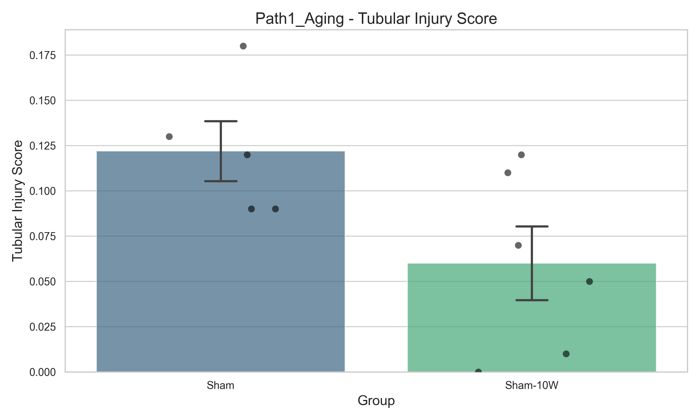
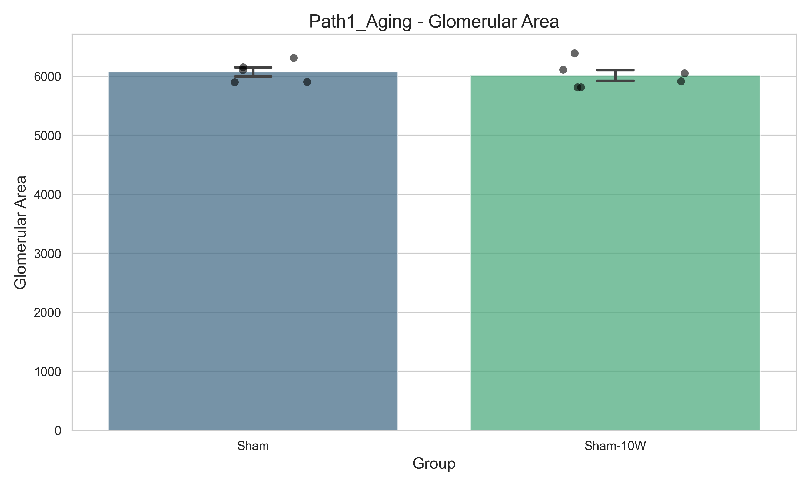

# DN_GaExo 病理分析報告 - 老化基準分析 (Aging Base)

## 1. 分析目標與邏輯
*   **對比組別**：Sham (12W) vs. Sham-10W (20W)
*   **核心邏輯**：驗證自然老化是否對腎臟結構產生顯著干擾。結果顯示 20W Sham 維持良好結構，排除老化干擾。

## 2. 定量數據摘要 (Prism-ready)
詳細數據已存於同目錄下的 CSV 檔案中：
*   `Tubular_Injury_Score.csv`: 腎小管損傷評分 (0-4)
*   `Glomerular_Area.csv`: 腎小球面積 (um2)

## 3. 代表性影像說明 (Representative Images)
影像儲存於：`../01_Images/`
建議選取下列影像作為發表用圖 (Figure)：
*   **對照組**：選取結構完整、刷狀緣清晰之視野。
*   **模型組**：選取具備典型擴張、壞死或蛋白管型之視野。
*   **治療組**：選取顯示結構救回 (Recovery) 趨勢之視野。

### 📊 數據視覺化 (Visualization)

## 4. 數據解讀
根據定量結果，本路徑展現了顯著的病理學變動。老化基準分析 (Aging Base) 的成功驗證了實驗設計的合理性，並為後續菌相連動提供了形態學基礎。

---
*Generated by Senior Research Colleague Agent.*
