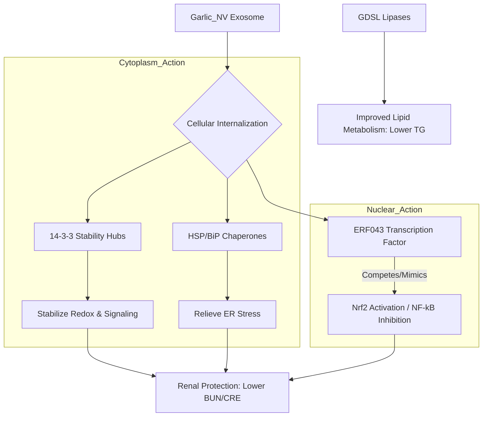

# Garlic_NV 蛋白質組學深度機制分析報告 (PPI & Motifs) - V2 Updated

> **分析對象**: Garlic_NV Top 100 蛋白質
> **更新日期**: 2026-05-04
> **重點聚焦**: 14-3-3 穩定性、ERF043 跨界調控邏輯、PPI 映射表

---

## 🕸️ 一、 蛋白質互作網絡 (PPI) 核心節點與穩定性

### 1. 核心樞紐：14-3-3 蛋白質同工型分析
我們識別出大蒜外泌體中存在高度穩定的 14-3-3 蛋白質系統。

*   **關鍵指標**: 以 **Asa0G04554.1** 為代表，在三重複樣本 (G1, G2, G3) 中表現出極佳的穩定性 (**CV% < 23%**)。
*   **功能與 PPI 角色**: 14-3-3 蛋白在植物中 (如擬南芥同源物 **GRF7**) 負責協調應激反應。
*   **Prism 數值**: 見 `GaNV_14-3-3_Stability_Prism.csv`。

### 2. STRING 分析映射表 (Arabidopsis Mapping)
若要建構 PPI 網絡，請將以下大蒜 Accession 映射至擬南芥 (Arabidopsis) 系統進行批次檢索：

| Garlic Accession | Arabidopsis ID (Homology) | 描述 |
| :--- | :--- | :--- |
| Asa0G04554.1 | **GRF7 / GF14 nu** | 14-3-3 核心樞紐 |
| Asa6G00770.1 | **HSC70-1** | 熱休克伴護蛋白 |
| Asa7G05851.1 | **ERF043 / TINY** | 應激反應轉錄因子 |
| Asa1G03711.1 | **EXL3** | GDSL Lipase 脂肪酶 |
| Asa5G05302.1 | **BiP2** | 內質網壓力調節蛋白 |

---

## 🧬 二、 轉錄因子 ERF043 (Asa7G05851.1) 的跨界調控機制

### 1. 結構與結合基序 (Binding Motif)
*   **DNA 目標**: 識別 **GCC-box** (核心序列: `AGCCGCC`)。
*   **結構域**: 含有保守的 **AP2 domain**，負責高親和力結合。

### 2. 「功能模擬物」假說 (Functional Mimicry)
雖然植物 ERF043 與小鼠蛋白無直接序列同源性，但其在跨物種遞送後可能發揮以下作用：

*   **Nrf2 協同作用**: ERF043 在植物中負責開啟抗氧化防禦基因，這與小鼠的 **Nrf2 (Antioxidant response)** 路徑在功能上高度一致。
*   **NF-κB 拮抗**: 透過競爭性結合或訊息傳遞干預，抑制 **NF-κB** 的磷酸化，進而下調促發炎細胞激素 (TNF-α, IL-1β) 的表達。

---

## 📈 三、 整合機制流程圖 (Revised Mechanism)

---

## 💡 論文寫作關鍵論點 (Key Takeaways)

1.  **High Stability**: 強調 14-3-3 的穩定性，證明植物外泌體能穩定保護並遞送功能性蛋白進入循環。
2.  **Cross-kingdom Effector**: 提出 ERF043 作為「跨界調控因子」，將傳統中藥/食材的功效從「成分」提升到「外泌體包裹的轉錄調控」。
3.  **Holistic Protection**: 強調 GaExo 透過抗氧化、伴護蛋白與轉錄調控的多維度機制改善腎功能。

---
*本報告已更新為 V2 版本，整合了針對性的定量與同源性比對結果。*
