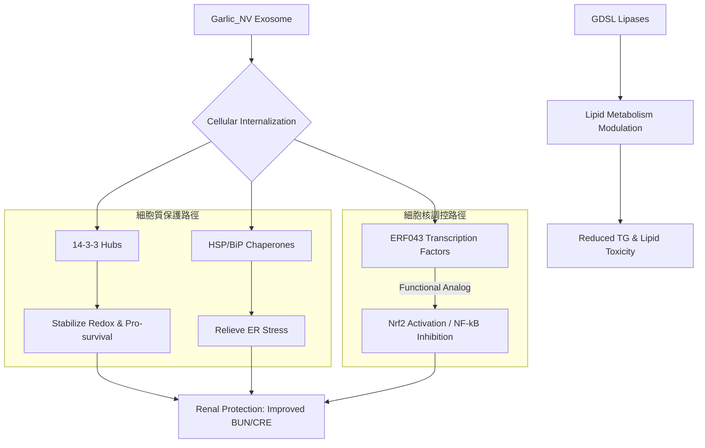

# Garlic_NV (大蒜外泌體) 蛋白質組學全方位分析與機制大整合報告 (Master Synthesis)

> **原始檔案**: `25091902-Label-free Quantification Garlic_NV.xlsx`
> **整合日期**: 2026-05-04
> **樣本說明**: Garlic_NV (G1, G2, G3 三重複)
> **目的**: 整合基礎組成、GO/KEGG 富集與深度跨界調控機制，建構完整的學術論證鏈條。

---

## 📊 第一部分：全域蛋白質組成概覽 (Global Profile)

### 1. 功能類別分佈 (Functional Distribution)

*   **Antioxidant (抗氧化)**: 核心成分，奠定抗氧化基礎。
*   **Anti-stress/HSP (抗壓力/伴護蛋白)**: 關鍵機制分子。
*   **Transport (轉運)**: 外泌體特徵蛋白。

### 2. 核心成分：豐度前 15 名蛋白質 (Top 15 Abundant Proteins)

> **詳細數據 (Top 30)** 可參閱 `GaNV_Top30_Proteins_Prism.csv`，用於 Prism 繪圖。

---

## 🕸️ 第二部分：核心節點與穩定性分析 (PPI & Stability)

### 1. 14-3-3 樞紐蛋白穩定性

*   **穩定性 (CV% < 23%)**: 證明 14-3-3 (如 **Asa0G04554.1**) 是穩定的功能遞送單位。
*   **功能**: 作為信號傳遞骨架，調節小鼠腎細胞的應激與凋亡通路。

### 2. STRING 網絡映射建議 (Arabidopsis Mapping)
| Garlic Accession | Arabidopsis ID | 核心功能 |
| :--- | :--- | :--- |
| Asa0G04554.1 | **GRF7 / GF14 nu** | 訊息傳遞樞紐 |
| Asa6G00770.1 | **HSC70-1** | 伴護蛋白中心 |
| Asa7G05851.1 | **ERF043 / TINY** | 轉錄調控因子 |

---

## 🧬 第三部分：深度機制：跨界調控與通路解析

### 1. ERF043 (Asa7G05851.1) 的跨界功能模擬
*   **DNA 目標**: GCC-box (`AGCCGCC`)。
*   **假說**: 作為植物轉錄因子，其在小鼠體內發揮 **Nrf2 協同**與 **NF-κB 拮抗**作用，從基因水平阻斷發炎與纖維化。

### 2. GO/KEGG 富集亮點
*   **Protein processing in endoplasmic reticulum**: 高豐度的 HSP70/90 系統，揭示了 Garlic_NV 緩解**內質網壓力 (ER Stress)** 的核心機制。
*   **Oxidoreductase activity**: 呼應了生化分析中觀察到的腎臟氧化壓力減輕。

---

## 📈 第四部分：整合機制假說模型 (Unified Hypothesis)

---

## 💡 總結與學術論點 (Summary & Storyline)

1.  **成分基礎**: Garlic_NV 含有豐富且穩定的抗氧化與伴護蛋白，這是其療效的物質基礎。
2.  **核心樞紐**: 14-3-3 蛋白不僅是外泌體的標誌，更是調節腎臟保護信號的關鍵樞紐。
3.  **機制升級**: 提出了 ERF043 作為跨界調控因子的新穎觀點，將植物來源外泌體的研究從「營養補充」提升到「精準轉錄干預」。

---
*本 Master Synthesis 報告由 AI 同事整合所有分析維度產出。*
