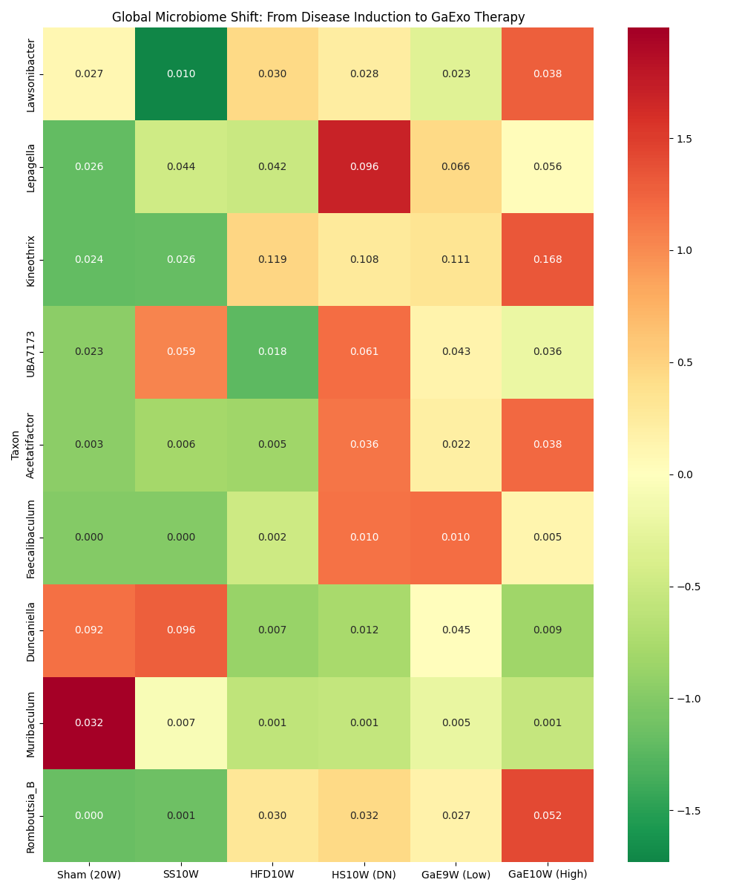

# Path 1~7 腸道菌叢與生理數據分析照片彙整報告

> **分析日期**: 2026-05-04
> **專案名稱**: DN_GaExo (大蒜外泌體治療糖尿病腎病變)
> **目的**: 彙整 Path 1 至 Path 7 的所有關鍵分析圖表，包含生理生化數據與 16S rRNA 菌相分析結果。

---

## 📍 Path 1: 成年期自然老化基準線 (Aging Baseline)
**對象**: Sham (12W) vs. Sham (20W)

### 1. 生理生化摘要

### 2. 菌相多樣性與組成
| Alpha 多樣性 | Beta 多樣性 (PCoA) |
| :---: | :---: |
|  |  |

### 3. 物種組成與相關性

### 4. 老化 vs. 疾病排除分析

---

## 📍 Path 2: 急性腎損傷期 (Acute Kidney Injury)
**對象**: Sham (12W) vs. DN (Acute/2W)

### 1. 生理生化摘要

### 2. 菌相多樣性與組成
| Alpha 多樣性 | Beta 多樣性 (PCoA) |
| :---: | :---: |
|  |  |

### 3. 物種組成與相關性

---

## 📍 Path 3: 慢性/晚期病程 (Late/Chronic Stage)
**對象**: Sham (20W) vs. DN (Late/10W)

### 1. 生理生化摘要

### 2. 菌相多樣性與組成
| Alpha 多樣性 | Beta 多樣性 (PCoA) |
| :---: | :---: |
|  |  |

### 3. 物種組成與相關性

---

## 📍 Path 4: 病程進展動態 (Disease Progression)
**對象**: Sham (12W) -> DN (2W) -> DN (10W)

### 1. 生理生化進展

### 2. 菌相多樣性動態
| Alpha 進展 | Beta PCoA 軌跡 |
| :---: | :---: |
|  |  |

### 3. 關鍵菌屬熱圖與組成

---

## 📍 Path 5: 不同疾病模型驅動因素 (Model Drivers)
**對象**: Sham vs. UUO vs. DN

### 1. 生理指標比較

### 2. 菌相多樣性比較
| Alpha 比較 | Beta PCoA 比較 |
| :---: | :---: |
|  |  |

### 3. 驅動因子比較圖

---

## 📍 Path 6: 大蒜外泌體治療效果 (Therapy Efficacy)
**對象**: DN vs. DN+GaExo (L/M/H)

### 1. 治療劑量效應摘要

### 2. 菌相修復多樣性
| Alpha 修復 | Beta PCoA 恢復 |
| :---: | :---: |
|  |  |

### 3. 治療比較與特異菌屬熱圖

---

## 📍 Path 7: 全域整合分析 (Global Synthesis)
**對象**: 所有組別整合比較

### 1. 全域菌相景觀
| 全域 Alpha 分佈 | 全域 Beta PCoA |
| :---: | :---: |
|  |  |

### 2. 跨路徑關鍵菌屬全景熱圖

---
*本彙整報告由 AI 同事生成，圖表路徑已根據 02_Analysis 目錄結構優化。*
