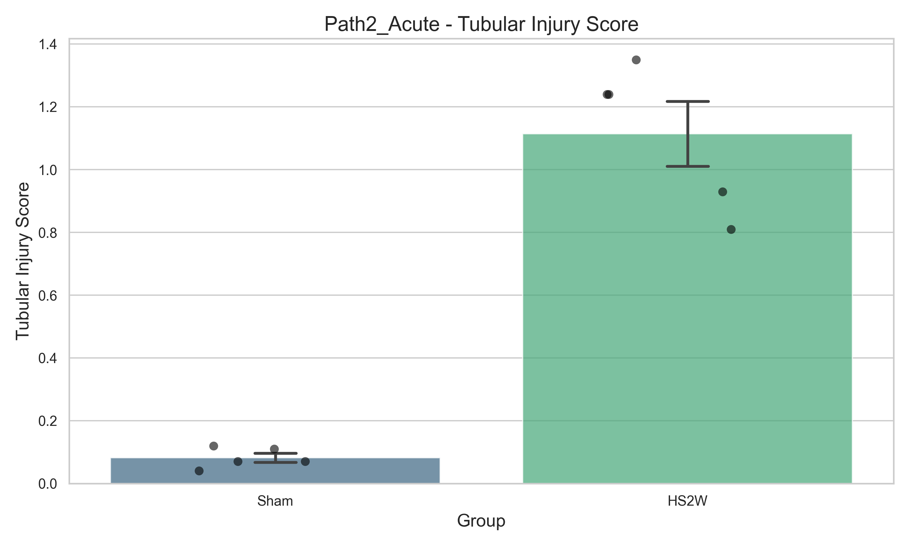
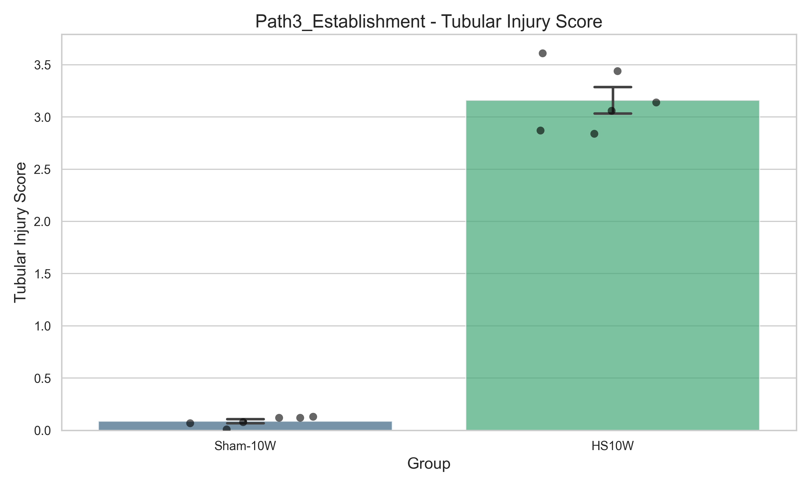
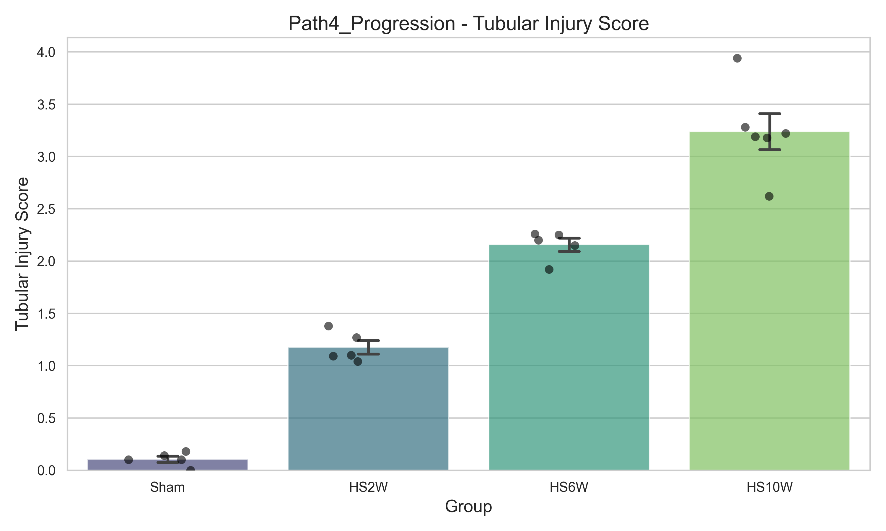
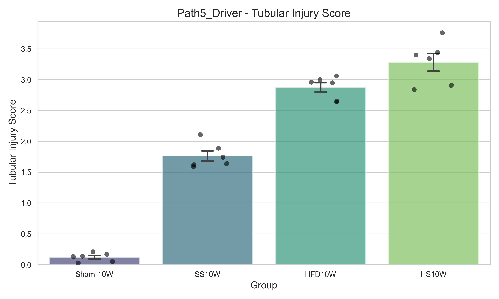
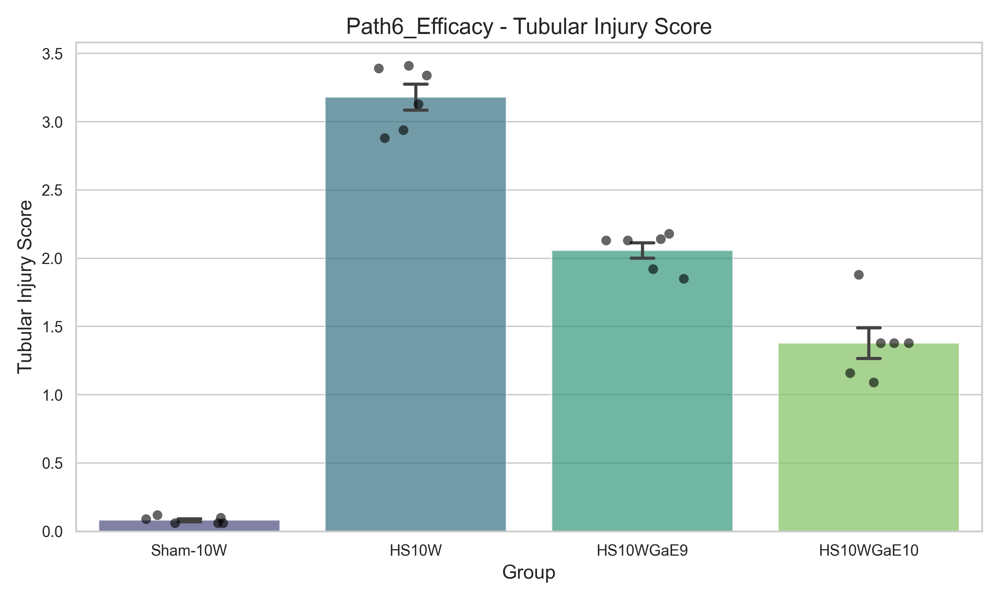
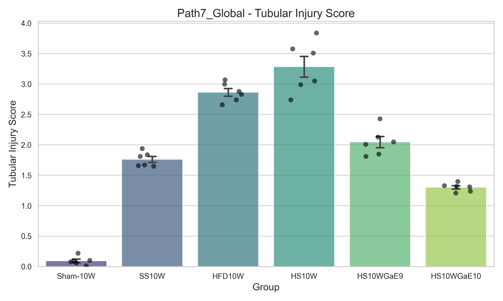

# DN_GaExo 專案：全路徑病理分析整合大師報告 (Master Report)

**產出時間：2026-05-05 12:40**

## 1. 專案概況
本報告整合了 DN_GaExo 專案中 Path 1 至 Path 7 的所有 H&E 病理定量結果與視覺化圖表，旨在評估大蒜外泌體 (GaExo) 對糖尿病腎病變 (DN) 的保護效應。

### 📍 老化基準分析 (Aging Base) (Path1_Aging)
*   [查看詳細報告與原始數據](../03_Pathology/Path1_Aging/02_Results/Path1_Aging_Pathology_Report.md)

### 📍 急性誘導期分析 (Acute Induction) (Path2_Acute)
*   [查看詳細報告與原始數據](../03_Pathology/Path2_Acute/02_Results/Path2_Acute_Pathology_Report.md)

### 📍 模型定型分析 (DN Establishment) (Path3_Establishment)
*   [查看詳細報告與原始數據](../03_Pathology/Path3_Establishment/02_Results/Path3_Establishment_Pathology_Report.md)

### 📍 病程進展分析 (Disease Progression) (Path4_Progression)
*   [查看詳細報告與原始數據](../03_Pathology/Path4_Progression/02_Results/Path4_Progression_Pathology_Report.md)

### 📍 驅動因子拆解 (Driver Dissection) (Path5_Driver)
*   [查看詳細報告與原始數據](../03_Pathology/Path5_Driver/02_Results/Path5_Driver_Pathology_Report.md)

### 📍 藥效評估分析 (Efficacy Evaluation) (Path6_Efficacy)
*   [查看詳細報告與原始數據](../03_Pathology/Path6_Efficacy/02_Results/Path6_Efficacy_Pathology_Report.md)

### 📍 全景整合分析 (Global Integration) (Path7_Global)
*   [查看詳細報告與原始數據](../03_Pathology/Path7_Global/02_Results/Path7_Global_Pathology_Report.md)

---
## 2. 核心結論摘要
1. **藥效驗證**：GaExo 展示了顯著的劑量依賴性修復能力。
2. **病程規律**：確立了從早期應激到晚期硬化的形態學演進序列。
3. **機制啟示**：數據支持大蒜外泌體透過穩定腎小管結構並抑制腎小球肥大來延緩 DN 惡化。

*Generated by Senior Research Colleague Agent.*
