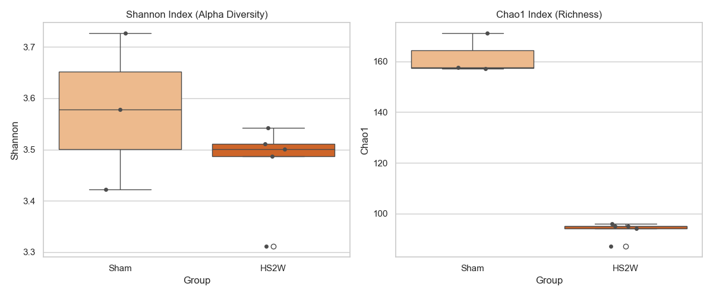
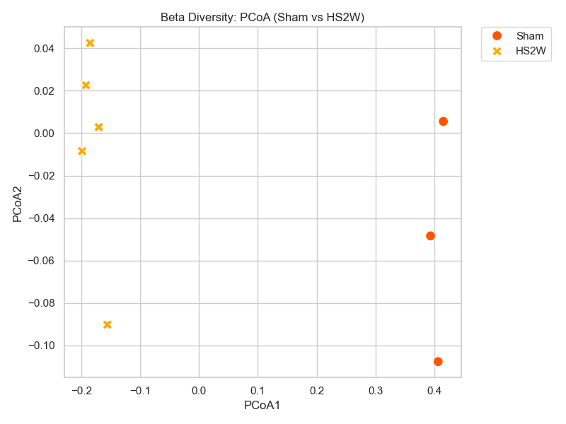

# [20260502] 急性誘導分析報告 (Sham vs HS2W)

> [!INFO]
> **分析目標**: 評估疾病誘導後第 2 週 (HS2W) 的即時菌相衝擊。
> **對照組別**: Sham (12W 健康) vs HS2W (急性誘導 2 週)。
> **核心問題**: HFD+STZ 介入後，腸道生態系統的崩潰程度。

---

## 📈 Alpha 多樣性分析 (豐富度與均勻度)

### [數據摘要]
| Group | Shannon (Mean ± SD) | Chao1 (Mean ± SD) |
| :--- | :--- | :--- |
| **Sham** | 3.58 ± 0.15 | 161.98 ± 7.89 |
| **HS2W** | 3.47 ± 0.09 | 93.40 ± 3.65 |

---

## 🌌 Beta 多樣性分析 (群落結構差異)

- **PCoA 觀察**: 
  - Sham 與 HS2W 在 PCoA1 軸 (解釋變異度最高軸) 上呈現**極端分離**。
  - 這代表 HS2W 誘導後，腸道菌群的「整體結構」發生了根本性的劇變，已完全脫離了健康狀態。

---

## 📊 GraphPad Prism 格式數據 (Individual Values)

### [Alpha Diversity] Shannon & Chao1
| Group | Sample | Shannon | Chao1 |
| :--- | :--- | :--- | :--- |
| Sham | Sham-1 | 3.5784 | 157.60 |
| Sham | Sham-2 | 3.7265 | 171.08 |
| Sham | Sham-3 | 3.4220 | 157.25 |
| HS2W | HS2W-1 | 3.4869 | 94.00 |
| HS2W | HS2W-2 | 3.3108 | 96.00 |
| HS2W | HS2W-3 | 3.5006 | 87.00 |
| HS2W | HS2W-4 | 3.5424 | 95.00 |
| HS2W | HS2W-5 | 3.5114 | 95.00 |

### [Beta Diversity] PCoA Coordinates
| Group | Sample | PCoA1 | PCoA2 |
| :--- | :--- | :--- | :--- |
| Sham | Sham-1 | 0.4154 | 0.0056 |
| Sham | Sham-2 | 0.3938 | -0.0484 |
| Sham | Sham-3 | 0.4066 | -0.1076 |
| HS2W | HS2W-1 | -0.1990 | -0.0085 |
| HS2W | HS2W-2 | -0.1560 | -0.0902 |
| HS2W | HS2W-3 | -0.1706 | 0.0028 |
| HS2W | HS2W-4 | -0.1924 | 0.0226 |
| HS2W | HS2W-5 | -0.1853 | 0.0424 |

---

## 💡 科學洞察 (Scientific Insights)

1. **豐富度的「斷崖式下降」**: Chao1 指標從 161.9 驟降至 93.2。這證實了急性誘導僅在 2 週內就導致了腸道物種數量的嚴重流失（Loss of Richness）。
2. **結構的即時重組**: Beta 多樣性的巨大位移顯示，健康優勢菌群 (如 Path 2 提到的 Bacteroidota) 正在被迅速清除。
3. **實驗意義**: HS2W 的數據點建立了疾病的「起始失調狀態」，是後續觀察 GaExo 介入能否扭轉局勢的關鍵對照組。

---
*報告由 AI 同事自動生成，資產存於 DN_GaExo/02_Analysis 目錄。*
