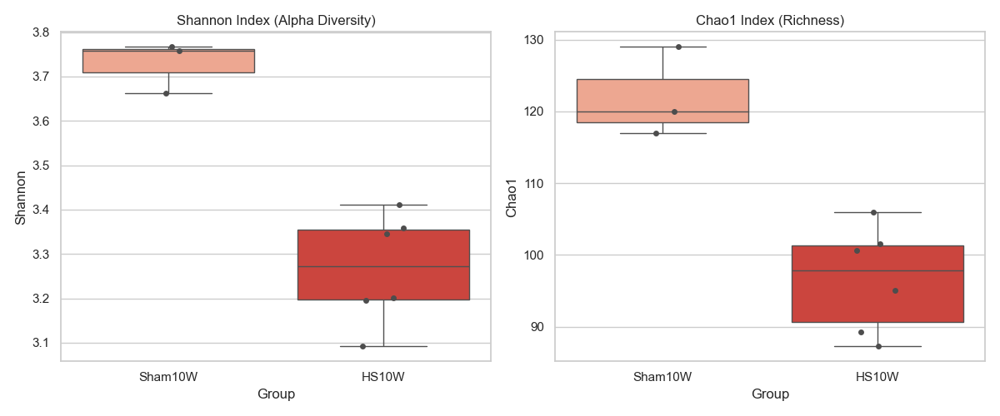
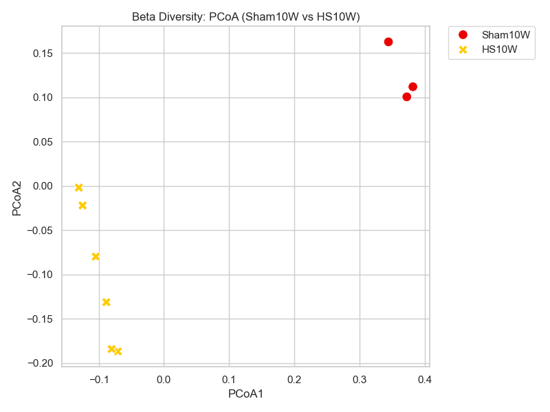

# [20260502] 慢性病程末期分析報告 (Sham10W vs HS10W)

> [!INFO]
> **分析目標**: 評估 10 週慢性病程後的腸道菌相最終狀態。
> **對照組別**: Sham10W (20W 老化對照) vs HS10W (10週病程末期)。
> **核心問題**: 排除自然老化因素後，糖尿病腎病變 (DN) 導致的持續性菌相損害。

---

## 📈 Alpha 多樣性分析 (豐富度與均勻度)

### [數據摘要]
| Group | Shannon (Mean ± SD) | Chao1 (Mean ± SD) |
| :--- | :--- | :--- |
| **Sham10W** | 3.73 ± 0.06 | 122.00 ± 6.24 |
| **HS10W** | 3.27 ± 0.12 | 96.61 ± 7.39 |

---

## 🌌 Beta 多樣性分析 (群落結構差異)

- **PCoA 觀察**: 
  - HS10W 組與 Sham10W 組在 PCoA 圖上呈現顯著的**極端分離**。
  - 主要差異依然集中在 PCoA1 軸，顯示疾病導致的結構變異遠大於隨機誤差或組內差異。

---

## 📊 GraphPad Prism 格式數據 (Individual Values)

### [Alpha Diversity] Shannon & Chao1
| Group | Sample | Shannon | Chao1 |
| :--- | :--- | :--- | :--- |
| Sham10W | Sham10W-4 | 3.6620 | 120.00 |
| Sham10W | Sham10W-5 | 3.7666 | 129.00 |
| Sham10W | Sham10W-6 | 3.7572 | 117.00 |
| HS10W | HS10W-1 | 3.2015 | 101.50 |
| HS10W | HS10W-2 | 3.3447 | 100.67 |
| HS10W | HS10W-3 | 3.3587 | 106.00 |
| HS10W | HS10W-4 | 3.4115 | 95.00 |
| HS10W | HS10W-5 | 3.0918 | 87.25 |
| HS10W | HS10W-6 | 3.1957 | 89.25 |

### [Beta Diversity] PCoA Coordinates
| Group | Sample | PCoA1 | PCoA2 |
| :--- | :--- | :--- | :--- |
| Sham10W | Sham10W-4 | 0.3446 | 0.1626 |
| Sham10W | Sham10W-5 | 0.3821 | 0.1120 |
| Sham10W | Sham10W-6 | 0.3728 | 0.1006 |
| HS10W | HS10W-1 | -0.0884 | -0.1312 |
| HS10W | HS10W-2 | -0.1046 | -0.0797 |
| HS10W | HS10W-3 | -0.1249 | -0.0220 |
| HS10W | HS10W-4 | -0.1307 | -0.0019 |
| HS10W | HS10W-5 | -0.0709 | -0.1867 |
| HS10W | HS10W-6 | -0.0803 | -0.1840 |

---

## 💡 科學洞察 (Scientific Insights)

1. **疾病疊加的老化惡化**: 雖然 Sham10W 組本身豐富度已下降，但 **HS10W 的豐富度 (Chao1: 96.6) 依然顯著低於健康老化組 (Chao1: 122.0)**。這說明 DN 病程對腸道生態系統造成了超越老化範圍的額外破壞。
2. **多樣性的持續低迷**: Shannon 指數從 3.73 降至 3.27，顯示菌相不僅是種類變少，且分佈極端不均，有害菌可能已佔據主導地位。
3. **結構性固化**: 末期 PCoA 的分群顯示腸道環境已完全轉向「病理性微生態」，這與 Path 3/4 提到的 Lepagella/Romboutsia 優勢化相符。

---
*報告由 AI 同事自動生成，資產存於 DN_GaExo/02_Analysis 目錄。*
