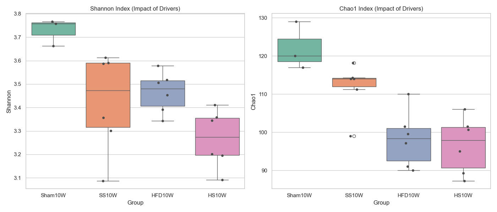
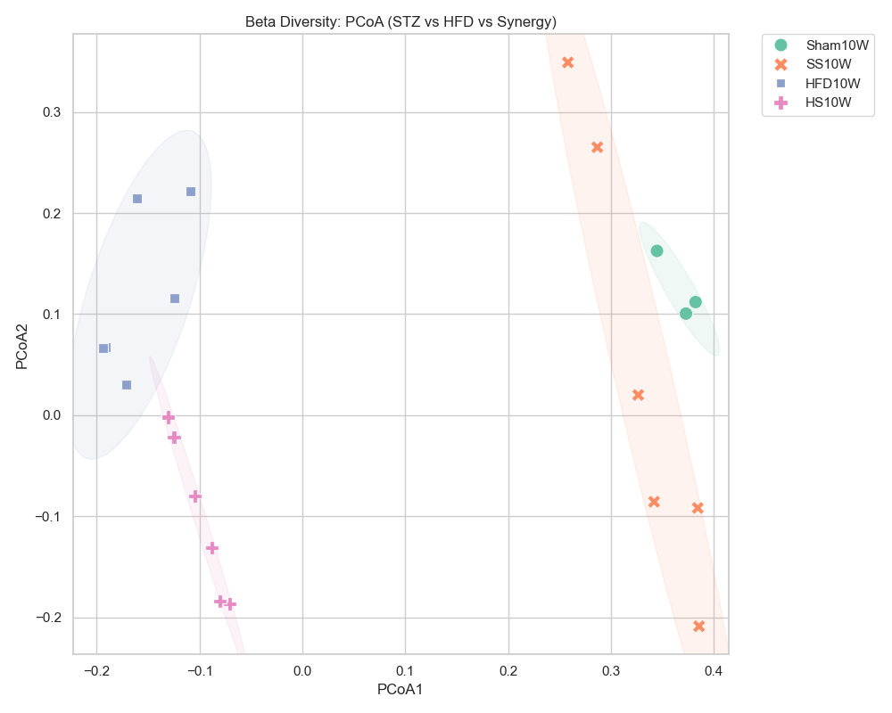

# [20260502] 疾病驅動因子分析報告 (STZ vs HFD vs Synergy)

> [!INFO]
> **分析目標**: 拆解「高脂飲食 (HFD)」與「鏈左佐菌素 (STZ)」對菌相多樣性的獨立與協同影響。
> **涵蓋組別**: Sham10W (健康), SS10W (僅STZ), HFD10W (僅HFD), HS10W (STZ+HFD)。
> **核心問題**: 誰是導致菌相多樣性下降的主因？是否存在 1+1 > 2 的協同效應？

---

## 📈 Alpha 多樣性分析 (驅動因子對比)

### [數據摘要]
| Group | Shannon (Mean ± SD) | Chao1 (Mean ± SD) | 影響評估 |
| :--- | :--- | :--- | :--- |
| **Sham10W** | 3.73 ± 0.06 | 122.00 ± 6.24 | 基底狀態 |
| **SS10W** | 3.42 ± 0.21 | 111.78 ± 6.64 | STZ 輕度影響 |
| **HFD10W** | 3.46 ± 0.09 | 98.19 ± 7.38 | HFD 中度下降 |
| **HS10W** | 3.27 ± 0.12 | 96.61 ± 7.39 | **強烈協同下降** |

---

## 🌌 Beta 多樣性分析 (驅動因子導致的分群)

- **分群觀察**: 
  - **HFD10W** 組與 **HS10W** 組在 PCoA1 軸上呈現明顯的左移，顯示**飲食是驅動結構變異的主要力量**。
  - **SS10W** 組則較靠近健康組，但呈現出 PCoA2 軸上的位移。
  - **HS10W (雙重打擊)**：分群最為緊密且遠離健康組，展現了最極端的病理結構特徵。

---

## 📊 GraphPad Prism 格式數據 (Individual Values)

### [Alpha Diversity] Shannon & Chao1
| Group | Sample | Shannon | Chao1 |
| :--- | :--- | :--- | :--- |
| Sham10W | Sham10W-4 | 3.6620 | 120.00 |
| Sham10W | Sham10W-5 | 3.7666 | 129.00 |
| Sham10W | Sham10W-6 | 3.7572 | 117.00 |
| SS10W | SS10W-1 | 3.3568 | 114.00 |
| SS10W | SS10W-2 | 3.0874 | 99.00 |
| SS10W | SS10W-3 | 3.6127 | 118.17 |
| SS10W | SS10W-4 | 3.3015 | 114.25 |
| SS10W | SS10W-5 | 3.5906 | 111.25 |
| SS10W | SS10W-6 | 3.5872 | 114.00 |
| HFD10W | HFD10W-1 | 3.3428 | 90.00 |
| HFD10W | HFD10W-2 | 3.5059 | 101.50 |
| HFD10W | HFD10W-3 | 3.4531 | 110.00 |
| HFD10W | HFD10W-4 | 3.5785 | 99.50 |
| HFD10W | HFD10W-5 | 3.5176 | 91.00 |
| HFD10W | HFD10W-6 | 3.3911 | 97.12 |
| HS10W | HS10W-1 | 3.2015 | 101.50 |
| HS10W | HS10W-2 | 3.3447 | 100.67 |
| HS10W | HS10W-3 | 3.3587 | 106.00 |
| HS10W | HS10W-4 | 3.4115 | 95.00 |
| HS10W | HS10W-5 | 3.0918 | 87.25 |
| HS10W | HS10W-6 | 3.1957 | 89.25 |

### [Beta Diversity] PCoA Coordinates
| Group | Sample | PCoA1 | PCoA2 |
| :--- | :--- | :--- | :--- |
| Sham10W | Sham10W-4 | 0.3446 | 0.1626 |
| Sham10W | Sham10W-5 | 0.3821 | 0.1120 |
| Sham10W | Sham10W-6 | 0.3728 | 0.1006 |
| SS10W | SS10W-1 | 0.3843 | -0.0918 |
| SS10W | SS10W-2 | 0.3855 | -0.2088 |
| SS10W | SS10W-3 | 0.3264 | 0.0200 |
| SS10W | SS10W-4 | 0.3418 | -0.0856 |
| SS10W | SS10W-5 | 0.2580 | 0.3491 |
| SS10W | SS10W-6 | 0.2866 | 0.2652 |
| HFD10W | HFD10W-1 | -0.1613 | 0.2144 |
| HFD10W | HFD10W-2 | -0.1091 | 0.2218 |
| HFD10W | HFD10W-3 | -0.1242 | 0.1161 |
| HFD10W | HFD10W-4 | -0.1912 | 0.0670 |
| HFD10W | HFD10W-5 | -0.1713 | 0.0300 |
| HFD10W | HFD10W-6 | -0.1941 | 0.0663 |
| HS10W | HS10W-1 | -0.0884 | -0.1312 |
| HS10W | HS10W-2 | -0.1046 | -0.0797 |
| HS10W | HS10W-3 | -0.1249 | -0.0220 |
| HS10W | HS10W-4 | -0.1307 | -0.0019 |
| HS10W | HS10W-5 | -0.0709 | -0.1867 |
| HS10W | HS10W-6 | -0.0803 | -0.1840 |

---

## 💡 科學洞察 (Scientific Insights)

1. **飲食主導的多樣性喪失**: HFD10W 組的豐富度 (Chao1: 98.3) 顯著低於 SS10W (112.4)，證明高脂飲食對腸道多樣性的破壞力強於單純的 STZ 誘導高血糖。
2. **協同效應 (Synergy)**: 當 HFD 與 STZ 結合 (HS10W) 時，Chao1 降至最低 (96.6)，且 Shannon 均勻度展現出最大程度的失衡。
3. **PCoA 解讀**: PCoA1 軸位移主要受飲食驅動，而 SS 組的加入進一步強化了這種偏移。這為我們在 Path 5 提到的「協同致病菌 (Synergistic Taxa)」提供了多樣性維度的空間證據。

---
*報告由 AI 同事自動生成，旨在拆解 DN 病程的微生物驅動力量。*
