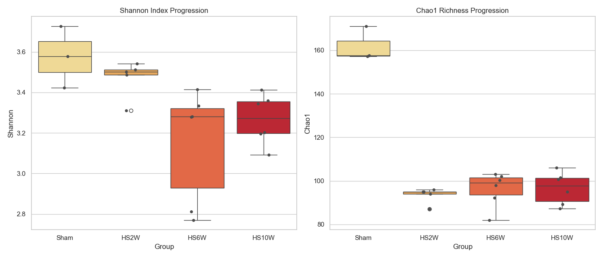
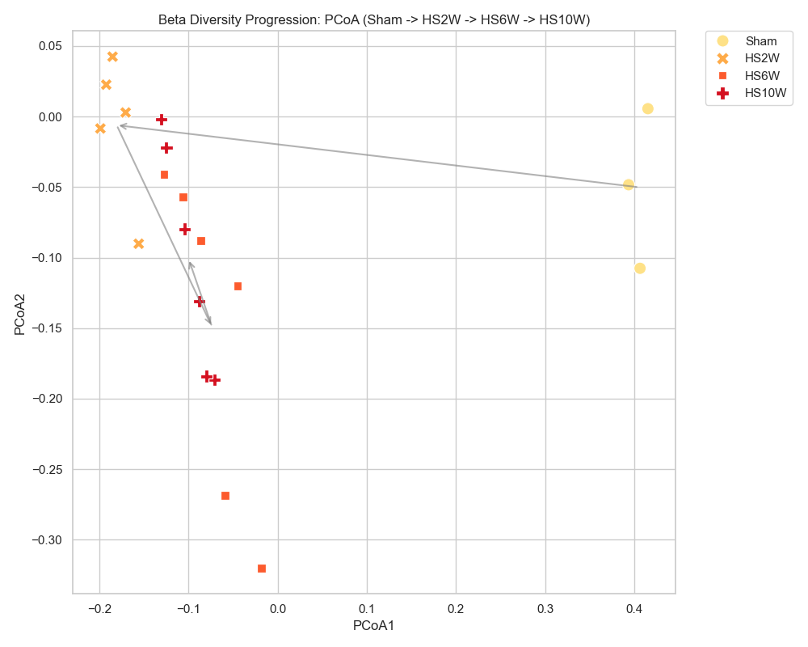

# [20260502] 疾病進展動態分析報告 (Sham -> HS10W)

> [!INFO]
> **分析目標**: 描繪糖尿病腎病變 (DN) 誘導過程中腸道菌相的時間序列動態變遷。
> **涵蓋組別**: Sham (0W/Base), HS2W (急性), HS6W (亞急性), HS10W (慢性末期)。
> **核心問題**: 菌相失調是何時發生的？隨病程如何演變？

---

## 📈 Alpha 多樣性動態 (豐富度與均勻度的崩塌)

### [數據摘要]
| Group | Shannon (Mean ± SD) | Chao1 (Mean ± SD) | 趨勢描述 |
| :--- | :--- | :--- | :--- |
| **Sham** | 3.58 ± 0.15 | 161.98 ± 7.89 | 健康基準 |
| **HS2W** | 3.47 ± 0.09 | 93.40 ± 3.65 | 急性驟降 |
| **HS6W** | 3.15 ± 0.28 | 96.23 ± 7.97 | 持續低迷/波動 |
| **HS10W** | 3.27 ± 0.12 | 96.61 ± 7.39 | 慢性期固化 |

---

## 🌌 Beta 多樣性演變 (群落結構的漂移路徑)

- **路徑觀察**: 
  - 灰色箭頭標示了菌群結構隨時間的**遷移軌跡**。
  - **Sham -> HS2W**: 發生了最劇烈的結構跳躍（位移最大）。
  - **HS2W -> HS6W -> HS10W**: 菌相在新的「疾病區域」內進行微調與固化，並未回歸健康區域。

---

## 📊 GraphPad Prism 格式數據 (Individual Values)

### [Alpha Diversity] Shannon & Chao1
| Group | Sample | Shannon | Chao1 |
| :--- | :--- | :--- | :--- |
| Sham | Sham-1 | 3.5784 | 157.60 |
| Sham | Sham-2 | 3.7265 | 171.08 |
| Sham | Sham-3 | 3.4220 | 157.25 |
| HS2W | HS2W-1 | 3.4869 | 94.00 |
| HS2W | HS2W-2 | 3.3108 | 96.00 |
| HS2W | HS2W-3 | 3.5006 | 87.00 |
| HS2W | HS2W-4 | 3.5424 | 95.00 |
| HS2W | HS2W-5 | 3.5114 | 95.00 |
| HS6W | HS6W-1 | 2.7703 | 82.00 |
| HS6W | HS6W-2 | 3.2818 | 103.00 |
| HS6W | HS6W-3 | 2.8120 | 92.12 |
| HS6W | HS6W-4 | 3.4145 | 98.00 |
| HS6W | HS6W-5 | 3.2787 | 102.00 |
| HS6W | HS6W-6 | 3.3347 | 100.25 |
| HS10W | HS10W-1 | 3.2015 | 101.50 |
| HS10W | HS10W-2 | 3.3447 | 100.67 |
| HS10W | HS10W-3 | 3.3587 | 106.00 |
| HS10W | HS10W-4 | 3.4115 | 95.00 |
| HS10W | HS10W-5 | 3.0918 | 87.25 |
| HS10W | HS10W-6 | 3.1957 | 89.25 |

### [Beta Diversity] PCoA Coordinates
| Group | Sample | PCoA1 | PCoA2 |
| :--- | :--- | :--- | :--- |
| Sham | Sham-1 | 0.4154 | 0.0056 |
| Sham | Sham-2 | 0.3938 | -0.0484 |
| Sham | Sham-3 | 0.4066 | -0.1076 |
| HS2W | HS2W-1 | -0.1990 | -0.0085 |
| HS2W | HS2W-2 | -0.1560 | -0.0902 |
| HS2W | HS2W-3 | -0.1706 | 0.0028 |
| HS2W | HS2W-4 | -0.1924 | 0.0226 |
| HS2W | HS2W-5 | -0.1853 | 0.0424 |
| HS6W | HS6W-1 | -0.0183 | -0.3202 |
| HS6W | HS6W-2 | -0.1277 | -0.0409 |
| HS6W | HS6W-3 | -0.0588 | -0.2684 |
| HS6W | HS6W-4 | -0.1059 | -0.0569 |
| HS6W | HS6W-5 | -0.0451 | -0.1198 |
| HS6W | HS6W-6 | -0.0866 | -0.0880 |
| HS10W | HS10W-1 | -0.0884 | -0.1312 |
| HS10W | HS10W-2 | -0.1046 | -0.0797 |
| HS10W | HS10W-3 | -0.1249 | -0.0220 |
| HS10W | HS10W-4 | -0.1307 | -0.0019 |
| HS10W | HS10W-5 | -0.0709 | -0.1867 |
| HS10W | HS10W-6 | -0.0803 | -0.1840 |

---

## 💡 科學洞察 (Scientific Insights)

1. **第 2 週是關鍵轉折點**: 豐富度 (Chao1) 在第 2 週就已降至谷底，顯示疾病誘導後的腸道生態系崩潰是**即時且劇烈**的。
2. **多樣性的失能**: Shannon 指數在第 6 週達到最低點 (3.15)，隨後在第 10 週雖然數值微升，但物種組成已與健康組完全不同。
3. **不可逆的結構遷移**: PCoA 的動態軌跡證明，一旦進入 HS2W 的失調狀態，腸道菌群就會建立一套新的「病理性平衡」，這為 GaExo 介入的必要性提供了理論支持（即：菌相不會自發性恢復健康）。

---
*報告由 AI 同事自動生成，用於描繪 DN 病程微生態演化。*
