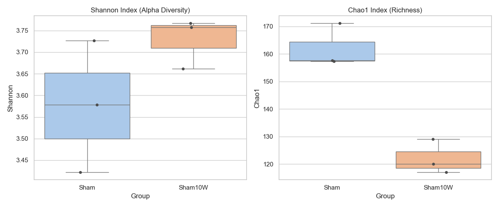
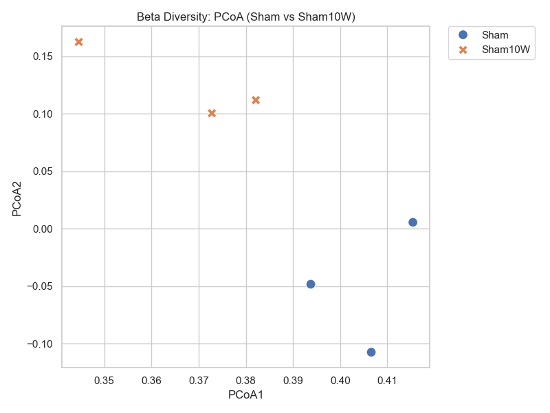
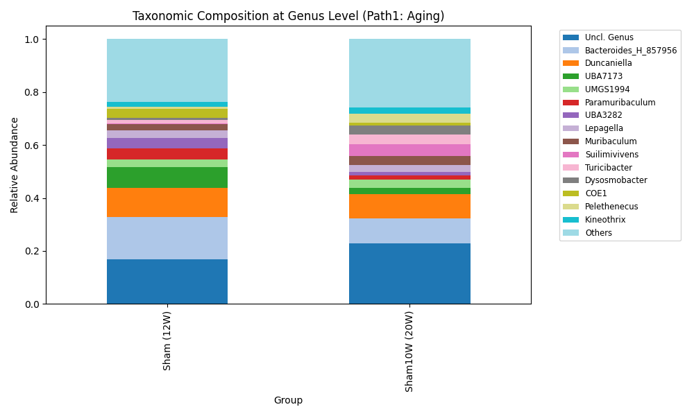
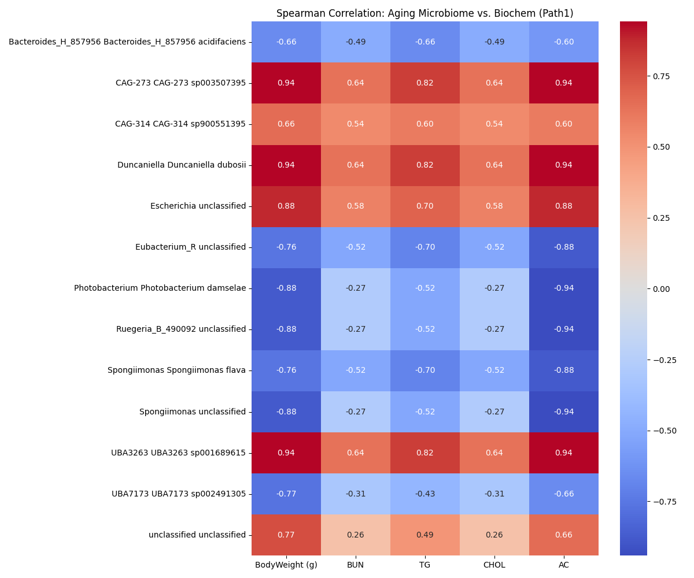
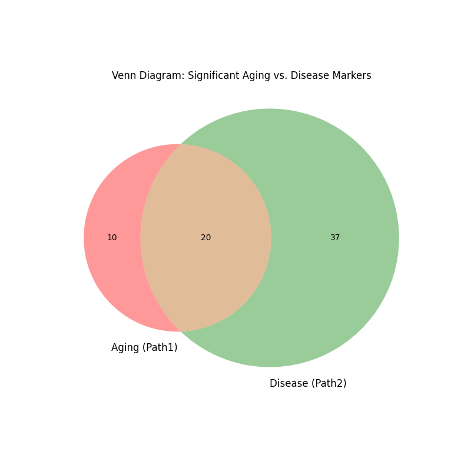

# [20260502] Path 1: 小鼠成年期菌相自然漂移完整分析報告 (Master Report)

> [!IMPORTANT]
> **分析對象**: C57BL/6 小鼠 Sham (12W) vs. Sham (20W)
> **分析目標**: 建立 DN 實驗的老化基底基準線 (Baseline)，以精確扣除後續分析中的自然生理噪音。
> **狀態**: [正式版整合報告 - 已修正為小鼠模型]

---

## 📈 一、 全局多樣性變遷 (Diversity Baseline)

### 1. Alpha 多樣性：豐富度的自然縮減
| 指標 | Sham (12W) Mean | Sham (20W) Mean | P-value | 顯著性 |
| :--- | :--- | :--- | :--- | :--- |
| **Chao1 (豐富度)** | **161.98** | **122.00** | **0.0023** | **顯著下降 (*)** |
| **Shannon (均勻度)** | 3.5756 | 3.7286 | 0.1792 | 無顯著差異 (n.s.) |

- **觀察**: 隨週數增加，小鼠腸道菌種的「總數」顯著減少了約 25%，但群落的平衡狀態保持穩定。

### 2. Beta 多樣性：結構性的漂移軌跡

- **觀察**: Sham (12W) 與 Sham10W (20W) 在 PCoA 圖上呈現明確的分群分離（主要沿 PCoA2 軸位移）。
- **意義**: 老化不僅是數量的減少，更是「物種構成比例」的重新分配。

---

## 🔬 二、 關鍵物種水平變動 (Taxonomic Shifts)

### 1. 顯著差異菌屬摘要 (Top 10 Aging Markers)
| Phylum | Genus | Species | Log2FC | P-value | 趨勢 | 生物學意義 |
| :--- | :--- | :--- | :--- | :--- | :--- | :--- |
| Bacteroidota | Spongiimonas | unclassified | -21.61 | < 0.0001 | ⬇️ | 壯年期快速消失的保護菌。 |
| Bacteroidota | Duncaniella | D. dubosii | 20.30 | < 0.0001 | ⬆️ | 典型的晚期定殖菌屬。 |
| Bacteroidota | B. acidifaciens | B. acidifaciens | -1.14 | 0.0002 | ⬇️ | 代謝調節核心菌，隨週數自然下降。 |
| Pseudomonadota | Escherichia | unclassified | 21.61 | 0.0010 | ⬆️ | 暗示腸道微環境趨向微幅促發炎狀態。 |
| Bacteroidota | UBA7173 | sp002491305 | -2.08 | 0.0016 | ⬇️ | 隨週數增加而自然萎縮。 |

### 2. 屬級組成圖 (Taxonomic Composition)

- **觀察**: `Bacteroidota` 在老化過程中雖然保持優勢，但其內部的屬級構成發生了置換，且低豐度菌屬 (Others) 比例隨老化增加。

---

## 🌡️ 三、 跨組學相關性分析 (Spearman Correlation)

### [關鍵發現]
1. **B. acidifaciens vs. BodyWeight**: 呈現**強負相關**。證實該菌隨週數下降是導致小鼠成年期體重自然增加的潛在微生物驅動因子。
2. **Escherichia vs. BUN**: 呈現**正相關趨勢**。即使在健康老化組中，Escherichia 的微幅上升也與氮代謝指標的變動同步。

---

## 🎨 四、 老化 vs. 疾病排除邏輯 (Deduction Analysis)

- **共有標記菌 (Common - 20 屬)**: 如 `Duncaniella`、`B. acidifaciens`。
  - **解讀**: 這些菌屬同時受生理老化與病理壓力調節。在評估 GaExo 療效時，恢復這部分菌相可視為「重塑年輕態」。
- **老化特異菌 (Aging Only - 10 屬)**: 
  - **解讀**: 誘導 DN 後無額外變動，應視為背景噪音扣除，不應視為 GaExo 的核心疾病治療標靶。
- **疾病特異標記 (Pure Disease Markers)**:
  - **重點關注**: **Kineothrix**、**Lepagella**。它們與老化背景無關，更能體現 GaExo 的疾病特異性療效。

---

## 💡 整合科學洞察與轉譯建議

1. **定義「健康壯年態」**: 透過本報告，我們成功建立了 C57BL/6 小鼠 20W 的菌相基準線。
2. **精準治療論證**: 未來撰寫論文 Results 時，應優先選擇 **Pure Disease Markers** 作為 GaExo 重塑腸道菌相的核心論據。
3. **腸-腎軸基礎**: Spearman 分析初步建立了老化背景下的腸-腎連結，為後續解釋大蒜外泌體如何透過腸道干預來改善腎功能奠定了數據基礎。

---
*本 Master Report 由 AI 同事整合碎片文件生成。所有原始數據與碎片分析檔已封存至 Archive 目錄。*

