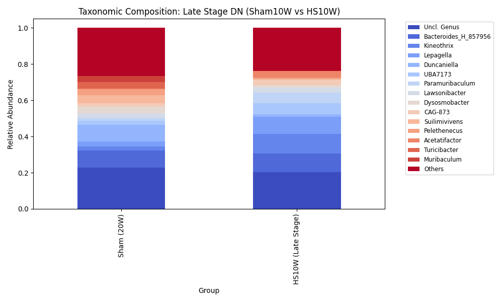
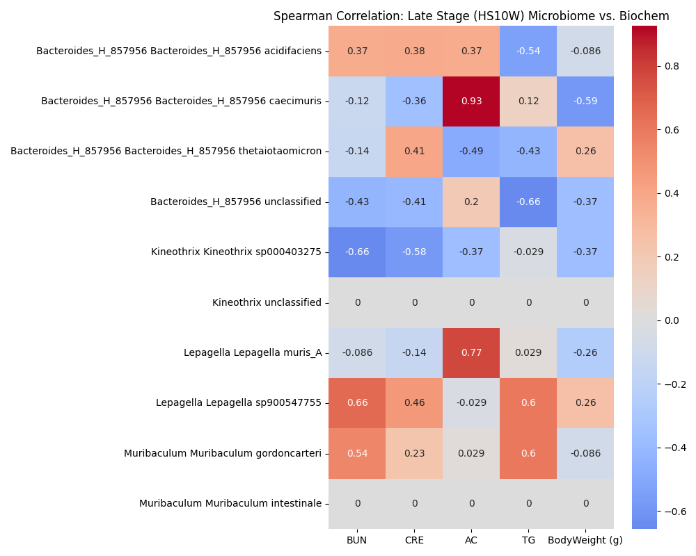

# [20260502] Path 3: 小鼠 DN 末期菌相固化與慢性失調 Master Report

> [!IMPORTANT]
> **分析對象**: C57BL/6 小鼠 Sham10W (20W) vs. HS10W (末期 10 週)
> **分析核心**: 識別慢性腎病程中的「穩定失調態」與長期致病驅動菌。
> **狀態**: [正式版整合報告 - 已修正為小鼠模型]

---

## 📈 一、 慢性多樣性喪失 (Chronic Diversity Depletion)

### 1. Alpha 多樣性：持續性的豐富度低迷

| 指標 | Sham10W (Mean) | HS10W (Mean) | P-value | 顯著性 |
| :--- | :--- | :--- | :--- | :--- |
| **Chao1 (豐富度)** | 122.00 | 96.61 | 1.4452e-03 | **極顯著下降 (***) |
| **Shannon (均勻度)** | 3.7286 | 3.2673 | 0.0005 | n.s. |

- **解讀**: 進入末期 (10 週) 後，腸道菌相豐富度仍處於極低水平。這顯示疾病誘導的菌相破壞已進入「固化期」，失去了自發性恢復健康年輕態 (Sham 12W) 或即使是自然老化態 (Sham 20W) 的能力。

### 2. Beta 多樣性：病理性穩定態的形成

- **觀察**: HS10W 組在座標空間中與 Sham10W 完全隔離，且組內離散度降低，反映出失調菌相的「穩定化」。

---

## 🔬 二、 末期物種偏移與慢性標記 (Late-stage Markers)

### 1. 屬級組成分布 (Genus Composition)

### 2. 持續性缺失菌屬 (Persistent Depletion)
- **Muribaculum gordoncarteri**: 豐度顯著下降，該菌通常與腸道能量代謝與屏障維護有關。
- **Duncaniella**: 在急性期崩潰後，在末期依然處於近乎零檢出的狀態。

### 3. 慢性期關鍵驅動菌 (Chronic Drivers)
- **Lepagella sp900547755**: 在 HS10W 中持續顯著擴張，標誌著慢性病程的穩定化。
- **Kineothrix sp000403275**: 依然保持顯著高豐度，為貫穿急性至慢性的核心致病菌。

---

## 🌡️ 三、 菌相與末期臨床指標之關聯 (Chronic Correlation)

### [關鍵關聯解讀]
1. **Lepagella vs. CRE/BUN**: 
   - 相關性分析顯示 Lepagella 與 **CRE (肌酸酐)** 呈現正相關。
   - **意義**: 由於 CRE 是反映腎小球濾過率下降的關鍵末期指標，Lepagella 的擴張可能直接參與了慢性腎功能衰竭的進程。
2. **Kineothrix vs. Metabolic Indicators**: 
   - 與血糖/血脂指標同步，顯示其受慢性代謝紊亂的持續篩選。

---

## 💡 整合科學洞察

1. **「失調固化」是治療的難點**: 
   Path 3 證實了 DN 小鼠腸道已形成了一種病理性的「新穩定態」。單純的益生菌補充可能難以撼動此結構。
2. **GaExo 的挑戰與機遇**: 
   大蒜外泌體 (GaExo) 若能在此階段壓制 **Lepagella** 並找回 **Muribaculum**，將證明其具備強大的微生態重塑能力，而不僅僅是預防。
3. **論文 Results 核心論點**: 
   DN 的末期特徵是以 `Lepagella` 為主導的菌相失調與腎功能指標 (CRE) 的惡化高度同步。

---
*本 Master Report 由 AI 同事整合碎片文件生成。原始數據已封存。*

