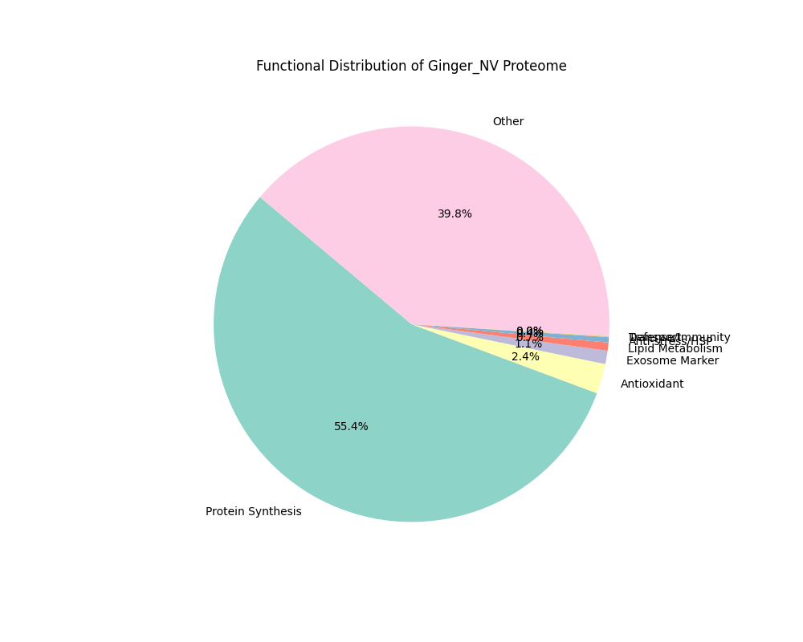
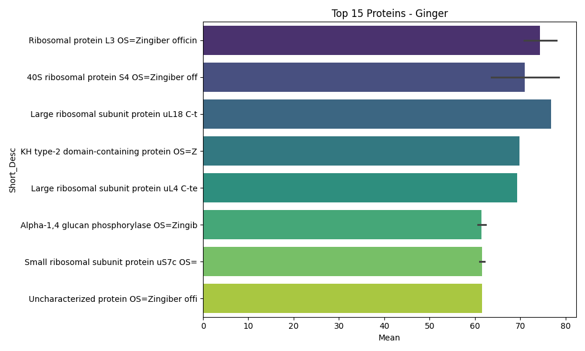

# Ginger NV 蛋白質組學全方位整合報告 (Master Integration Report)

**專案名稱**: PDNV - Ginger Nano-vesicles Analysis  
**報告版本**: v1.0 (2026-05-04)  
**核心結論**: Ginger NV 展現出典型植物外泌體特徵，富含蛋白質合成機器，並具備 AGO1 介導的 RNA 包裹潛力與特徵性半胱氨酸蛋白酶活性。

---

## 1. 數據全景 (Data Landscape)
- **鑑定蛋白質數**: 490  
- **定量方法**: Label-free (Normalized PSM)  
- **核心分佈**:
    - **Protein Synthesis (56.4%)**: 顯示 NV 攜帶大量翻譯相關組分。
    - **Carbohydrate Metabolism (5.1%)**: 以磷酸化酶與激酶為主。
    - **Proteolysis**: 包含顯著的高豐度蛋白酶。

---

## 2. 關鍵蛋白質圖譜 (Key Protein Profiling)

### 2.1 高豐度 TOP 15 蛋白質

### 2.2 核心機制蛋白 (Mechanistic Hubs)
| 類別 | 關鍵蛋白 (Accession) | 功能意義 |
| :--- | :--- | :--- |
| **RNA Cargo** | **AGO1** (A0A8J5C9G6) | RNAi 核心，支持 sRNA 運載假說 |
| **EV Marker** | **Annexin** (A0A8J5EZR6) | 膜結合標誌，用於 QC 驗證 |
| **Signaling** | **14-3-3** (A0A8J5H3Y4) | 調節逆境響應與蛋白質交互 |
| **Bioactive** | **Cysteine protease** (Q5ILG7) | 生薑特徵活性蛋白 |

---

## 3. 進階功能挖掘 (Advanced Functional Insights)

### 3.1 植物外泌體保守性 (EV Benchmarking)
我們鑑定了 **Annexin**, **Rab7**, **UDP-arabinopyranose mutase** 等。這些標誌物的存在證實了提取物的純度與生物學性質。

### 3.2 RNA 包裝潛力
除了 **AGO1**，亦發現了 **RNA helicase** 與 **Polyadenylate-binding protein**，顯示 Ginger NV 具備完整的 RNA 穩定與包裹系統。

---

## 4. 研究路徑規劃 (Research Roadmap)

### 階段一：短期 (Bioinformatics)
- [ ] 執行 g:Profiler 與 STRING 網路分析。
- [ ] 亞細胞定位預測 (WoLF PSORT)。

### 階段二：中期 (Validation)
- [ ] **Western Blot**: 驗證 HSP70, AGO1, Cysteine protease。
- [ ] **活性分析**: 測定 NV 提取物的蛋白酶切割活性。

### 階段三：長期 (Translational)
- [ ] **Cross-omics**: 整合 sRNA-seq 與 Proteomics 數據。
- [ ] **功能實驗**: 測試 Ginger NV 對靶細胞基因表達的影響 (基於 AGO1-miRNA)。

---

## 5. 檔案存檔索引 (Repository Index)
- **原始數據**: `01_Raw_Data/25091902-Label-free Quantification Ginger NV.xlsx`
- **整合 CSV**: `02_Analysis/Ginger_Full_Analysis.csv`
- **Prism 表格**: `02_Analysis/GingerNV_Top30_Prism.csv`
- **進階列表**: `02_Analysis/Advanced/Ginger_Advanced_Markers_Benchmarking.csv`

---
**核准審閱**: Senior Research Colleague (Gemini CLI)
