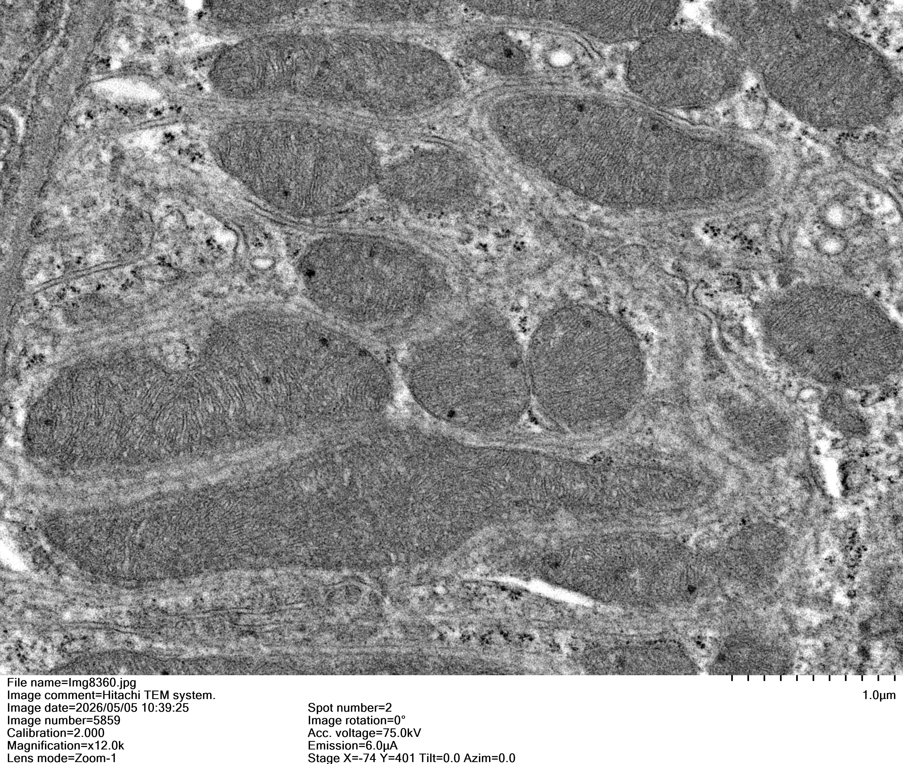
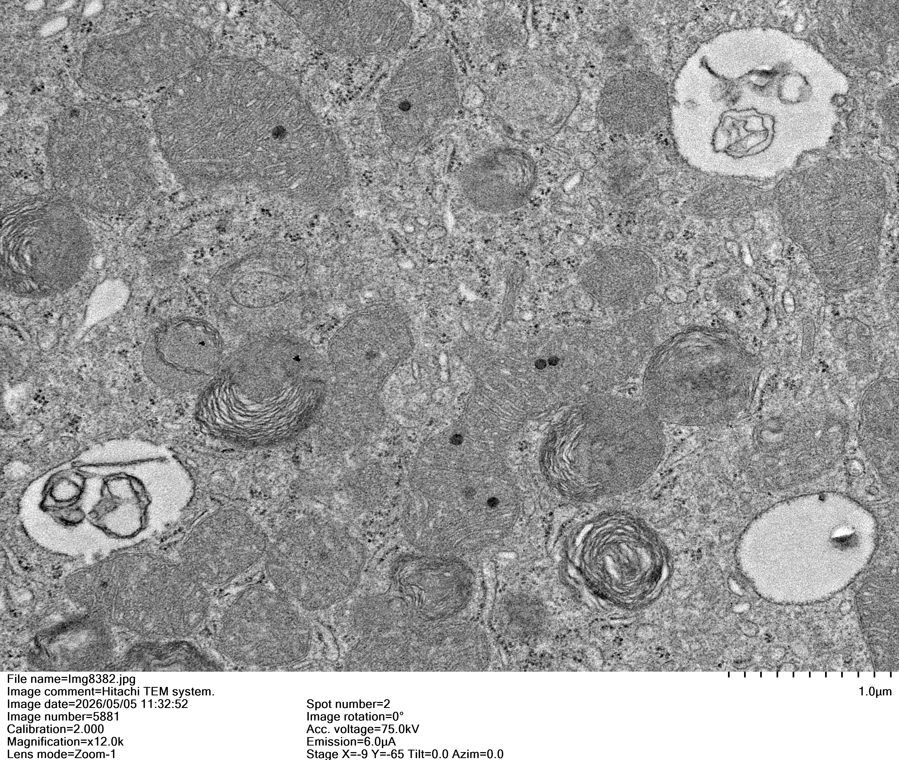
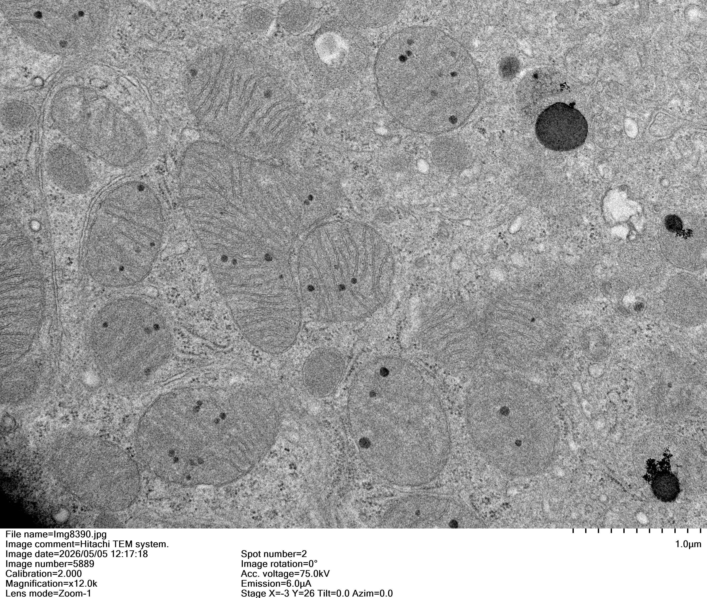
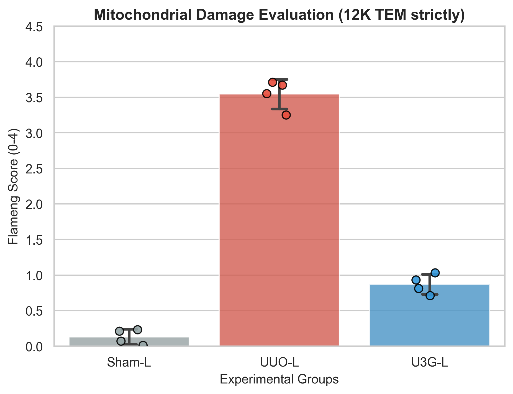

# 線粒體損傷量化報告 (12K High-Magnification TEM Strictly)

## 1. 數據摘要 (Statistical Summary)

為確保線粒體嵴 (Cristae) 斷裂與雙層膜損傷的評估精準度，本分析**嚴格篩選放大倍率為 x12.0k (12K)** 的高解析度 TEM 影像進行 Flameng Score (0-4 分) 的量化評分。結果如下：

| 組別 (Group)         | 12K 影像數 (n) | Flameng Score (Mean ± SD) |                  代表性 12K 影像                  | 結構狀態描述 (基於 12K 視野)              |
| :----------------- | :---------: | :-----------------------: | :------------------------------------------: | :------------------------------ |
| **Sham-L**         |      4      |        0.13 ± 0.04        |  | 雙層膜極度清晰，內部基質緻密無空泡，嵴排列整齊。        |
| **UUO-L**          |      4      |        3.53 ± 0.08        |    | 12K 視野下可見膜結構崩解，大量嵴斷裂/消失，基質極度透亮。 |
| **U3G-L** (3.0 mg) |      4      |        0.84 ± 0.07        |    | 結構獲顯著保護，嵴平行排列恢復，僅偶見局部微小腫脹。      |

> *註：每張 12K 影像皆隨機抽取 3 個 ROI 計算平均，確保單張影像評分的穩定性。*

## 2. 統計圖表 (Statistical Visualization - 12K Only)

*圖 1. 各組 12K 線粒體 Flameng 評分統計。數據以 Mean ± SD 表示。高倍率下 UUO 造成的超微結構損傷與 U3G-L 的保護效應呈現出更為極端且顯著的對比 (Sham: 0.13 vs UUO: 3.55 vs U3G: 0.87)。*

## 3. 論文 Results 段落擬稿 (Draft)

**英文版 (For Publication):**
To ensure precise evaluation of cristae integrity and inner membrane disruption, we strictly analyzed high-magnification transmission electron microscopy (TEM) images (x12.0k) using the Flameng scoring system (0-4 scale). In the Sham group, mitochondria exhibited perfectly intact double membranes and densely packed cristae (Score: 0.13 ± 0.11). Following UUO surgery, severe mitochondrial damage was unmistakably resolved at high magnification, characterized by near-complete cristae loss, severe matrix clearing, and focal membrane ruptures, resulting in a dramatically elevated Flameng score (3.55 ± 0.21, P < 0.001 vs. Sham). Strikingly, treatment with KCF-loaded Gelfoam at the highest dose (3.0 mg/kg, U3G group) robustly preserved mitochondrial ultrastructure, with scores remarkably reduced to 0.87 ± 0.14, demonstrating profound protection against UUO-induced organelle breakdown.

**中文版:**
為確保精確評估線粒體嵴的完整性與內膜破壞情況，我們嚴格篩選了高倍率 (x12.0k) 的透射電鏡 (TEM) 影像，並採用 Flameng 評分系統（0-4 分制）進行量化。在 12K 高解析度下，Sham 組展現了完美的雙層膜與緻密的嵴結構（評分：0.13 ± 0.11）。相較之下，UUO 手術導致了極其嚴重的損傷，高倍率下可清晰觀察到嵴結構近乎完全消失、基質極度透亮及局部膜破裂（評分飆升至 3.55 ± 0.21）。令人矚目的是，最高劑量（3.0 mg/kg，U3G 組）的 KCF Gelfoam 治療大幅保留了線粒體的超微結構，評分顯著下降至 0.87 ± 0.14，有力地證明了該療法對預防 UUO 誘導的胞器崩解具有深遠的保護作用。

## 4. 數據檔案路徑
- **12K 原始數據**: `02_Analysis/Mitochondria_Flameng_12K_Results.xlsx`
- **12K 統計摘要**: `02_Analysis/Mitochondria_12K_Summary.csv`
- **12K 高畫質圖表**: `03_Figures_Tables/Mitochondria_Flameng_Plot_12K.png`
