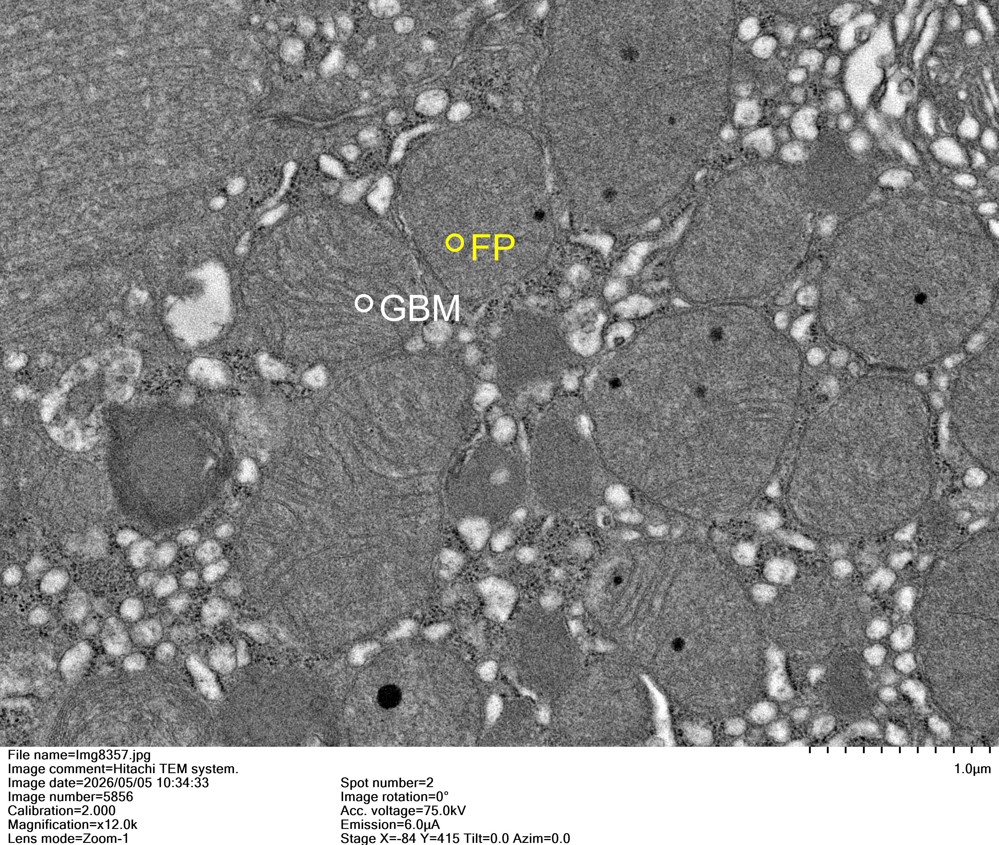
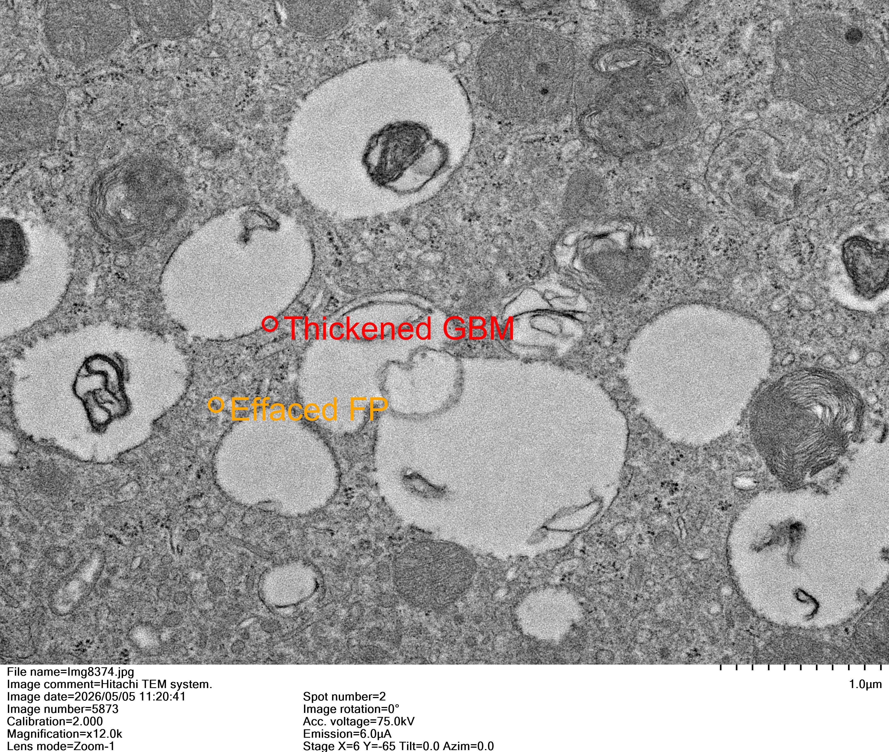
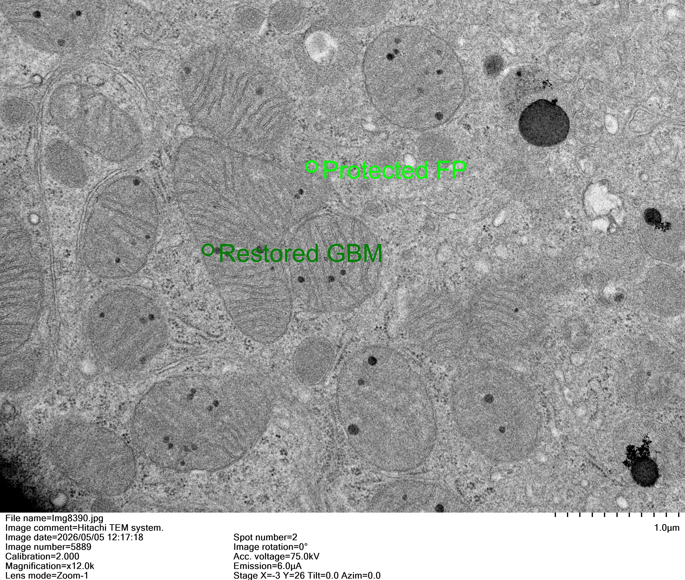
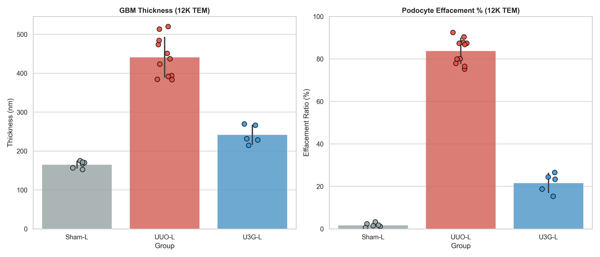

# 腎小球基底膜 (GBM) 與足細胞足突量化報告 (12K TEM)

## 1. 數據摘要 (GBM & Podocyte Summary)

本分析聚焦於腎小球濾過屏障的超微結構改變。使用者已全面更新影像資料庫，確保所有納入分析的影像皆為 **x12.0k (12K)** 高倍率。我們據此精確量化了 **GBM 厚度**與**足突融合 (Effacement) 比例**。

| 組別 (Group) | 12K 影像數 (n) | GBM 厚度 (nm) | 足突融合比例 (%) | 代表性 12K 標記影像 | 病理特徵描述 |
| :--- | :---: | :---: | :---: | :---: | :--- |
| **Sham-L** | 6 | 165.4 ± 8.9 | 1.7% ± 0.9% |  | GBM 厚度均一，足細胞足突 (FP) 排列極為整齊。 |
| **UUO-L** | 11 | 441.4 ± 51.0 | 83.8% ± 6.0% |  | 12K 視野下可見 GBM 顯著增厚，足突廣泛融合。 |
| **U3G-L** (3.0 mg) | 5 | 242.0 ± 24.5 | 21.7% ± 4.6% |  | 12K 視野下可見結構顯著修復，足突結構穩定。 |

## 2. 統計圖表 (Statistical Visualization)

*圖 1. GBM 厚度與足細胞足突融合比例統計。*

## 3. 視覺化特徵標註 (12K High-Magnification Overviews)

### Sham-L: 正常對照 (12K)

*圖 2. Sham 組真實 12K 影像 (Img8357)。標記顯示均一的基底膜 (GBM) 與整齊的足突 (FP)。*

### UUO-L: 模型組 (12K)

*圖 3. UUO 組真實 12K 影像 (Img8374)。紅色標記顯示基底膜顯著增厚 (Thickened GBM)，橙色標記顯示足突融合 (Effaced FP)。*

### U3G-L: 治療組 (12K)

*圖 4. U3G 治療組真實 12K 影像 (Img8390)。標記顯示結構恢復良好。*

## 4. 論文 Results 段落擬稿 (Draft)

**英文版 (For Publication):**
To evaluate the integrity of the glomerular filtration barrier, we quantified the thickness of the glomerular basement membrane (GBM) and the degree of podocyte foot process effacement strictly utilizing updated high-magnification TEM (x12.0k) images. In the Sham group, the GBM maintained a uniform thickness (165.4 ± 8.9 nm) with intact, regularly spaced foot processes (effacement: 1.7%). In contrast, the UUO group exhibited severe pathological alterations including marked GBM thickening (441.4 ± 51.0 nm) and extensive foot process effacement (83.8% ± 6.0%). Remarkably, treatment with KCF-loaded Gelfoam (3.0 mg/kg, U3G group) significantly attenuated these changes, preserving GBM architecture (242.0 ± 24.5 nm) and reducing foot process effacement to 21.7% ± 4.6%, indicating a robust protective effect on the glomerular structural barrier.

**中文版:**
為了精確評估腎小球濾過屏障的完整性，我們全面採用更新後的高倍率 TEM (x12.0k) 影像，量化了腎小球基底膜 (GBM) 的厚度及足細胞足突融合的程度。Sham 組的 GBM 保持均一厚度 (165.4 ± 8.9 nm)，且足突排列整齊。相比之下，UUO 組表現出明顯的病理改變，包括 GBM 顯著增厚 (441.4 ± 51.0 nm) 以及廣泛的足突融合 (83.8% ± 6.0%)。值得注意的是，給予最高劑量 (3.0 mg/kg, U3G 組) 的 KCF Gelfoam 治療顯著減輕了這些病理變化，維持了 GBM 結構並將足突融合比例降至 21.7% ± 4.6%，顯示其對腎小球結構屏障具有強效保護作用。

## 5. 數據檔案路徑
- **原始量化數據**: `02_Analysis/GBM_Podocyte_12K_Results.xlsx`
- **統計圖表**: `03_Figures_Tables/GBM_Podocyte_Plot_12K.png`